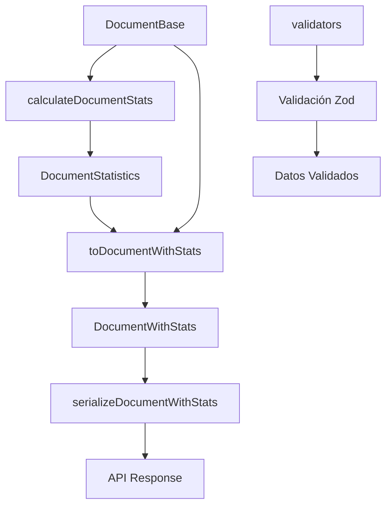

# 📄 Transformador Document

**Transformaciones y validaciones para la entidad Document en el sistema de gestión de archivos.**
✅ MIGRADO A DRIZZLE - Enero 2025

## Visión General

El transformador Document gestiona documentos de texto (PDF, DOC, DOCX, TXT, etc.) con capacidades de análisis de contenido, extracción de metadatos y cálculo de métricas de lectura.

## Funcionalidades Principales

### 🔄 Transformaciones

* **toDocumentWithStats**: Enriquece documentos base con estadísticas calculadas
* **toDocumentWithStatsList**: Procesa listas de documentos con estadísticas

### 📊 Estadísticas Calculadas

* **wordCount**: Número total de palabras extraídas
* **charCount**: Número total de caracteres del contenido
* **readingTime**: Tiempo estimado de lectura (200 palabras/minuto)
* **versionCount**: Número de versiones del documento

### 🔒 Serialización Segura

* **serializeDocumentBase**: Serialización básica omitiendo contenido sensible
* **serializeDocumentWithStats**: Serialización completa con estadísticas
* **serializeDocumentContent**: Serialización específica para contenido

## Arquitectura



## Tipos Base

### DocumentBase

```typescript
interface DocumentBase {
  id: string;
  name: string;
  path: string;
  size: number;
  hash: string;
  mimeType: string;
  extension: string;
  folderId: string;
  isFavorite: boolean;
  isArchived: boolean;
  pageCount: number | null;
  wordCount: number | null;
  language: string | null;
  // ... metadatos de PDF/documento
  content: string | null;
  summary: string | null;
  createdAt: Date;
  updatedAt: Date;
}
```

### DocumentStatistics

```typescript
interface DocumentStatistics {
  wordCount: number;
  charCount: number;
  readingTime: number;
  versionCount: number;
}
```

## Validaciones

### Campos Requeridos

* `name`: 1-255 caracteres
* `path`: Ruta válida en el sistema
* `hash`: Hash único del archivo
* `mimeType`: Tipo MIME válido
* `folderId`: UUID de la carpeta padre

### Validaciones Específicas

* `size`: Número positivo
* `pageCount`: Entero positivo o null
* `wordCount`: Entero positivo o null
* `encrypted`: Boolean o null

## Casos de Uso

### 📄 Procesamiento de Documentos

```typescript
import { toDocumentWithStats } from '@/transformers/document';

const documentWithStats = toDocumentWithStats(drizzleDocument);
console.log(`Tiempo de lectura: ${documentWithStats.stats.readingTime} minutos`);
```

### 🔍 Búsqueda de Documentos

```typescript
import { documentSearchSchema } from '@/transformers/document/validators';

const searchCriteria = documentSearchSchema.parse({
  query: 'presupuesto',
  author: 'Juan Pérez',
  mimeType: 'application/pdf',
  minWordCount: 1000
});
```

### 📊 Análisis de Contenido

```typescript
import { serializeDocumentContent } from '@/transformers/document/serializers';

const documentContent = serializeDocumentContent(document);
// Acceso seguro al contenido para análisis
```

## Integraciones

### 🗂️ Gestión de Archivos

* Integración con sistema de carpetas
* Gestión de favoritos y archivado
* Control de versiones

### 🔍 Búsqueda y Filtrado

* Búsqueda por contenido
* Filtros por metadatos
* Búsqueda por autor/idioma

### 📊 Analytics

* Métricas de lectura
* Análisis de uso
* Estadísticas de contenido

## Consideraciones Técnicas

### 🚀 Performance

* Cálculo lazy de estadísticas
* Paginación en listados grandes
* Índices en campos de búsqueda

### 🔒 Seguridad

* Omisión de contenido en serialización estándar
* Validación de tipos MIME
* Control de acceso por carpeta

### 📈 Escalabilidad

* Procesamiento asíncrono de contenido
* Cache de estadísticas calculadas
* Compresión de contenido largo
