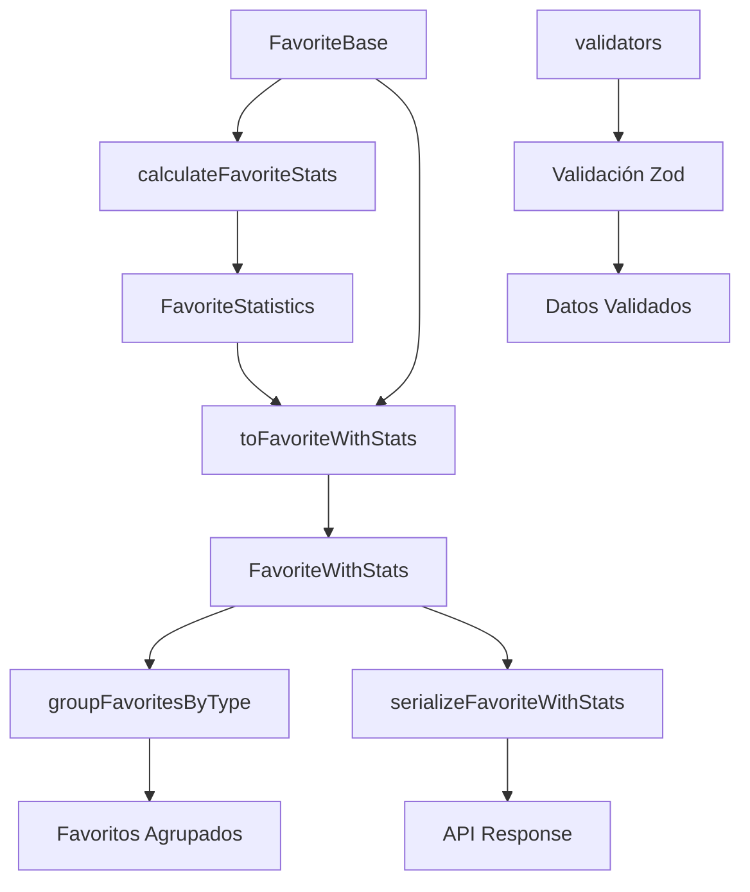

# ⭐ Transformador Favorite

**Transformaciones y validaciones para la entidad Favorite en el sistema de gestión de favoritos.**
✅ MIGRADO A DRIZZLE - Enero 2025

## Visión General

El transformador Favorite gestiona las entidades marcadas como favoritas por los usuarios, proporcionando capacidades de análisis temporal, agrupación por tipo y estadísticas de uso.

## Funcionalidades Principales

### 🔄 Transformaciones

* **toFavoriteWithStats**: Enriquece favoritos base con estadísticas calculadas
* **toFavoriteWithStatsList**: Procesa listas de favoritos con estadísticas

### 📊 Estadísticas Calculadas

* **entityTypeName**: Nombre legible del tipo de entidad favorita
* **formattedCreatedAt**: Fecha de creación formateada en español
* **daysSinceFavorited**: Días transcurridos desde que se marcó como favorito
* **isRecent**: Indicador de favorito reciente (≤ 7 días)
* **isOld**: Indicador de favorito antiguo (> 30 días)

### 🔒 Serialización y Agrupación

* **serializeFavoriteWithStats**: Serialización completa con estadísticas
* **groupFavoritesByType**: Agrupación por tipo de entidad
* **getFavoritesSummary**: Resumen estadístico general

## Arquitectura



## Tipos Base

### FavoriteBase

```typescript
interface FavoriteBase {
  id: string;
  entityId: string;
  entityType: FavoriteEntityType;
  userId: string | null;
  profileId: string | null;
  createdAt: Date;
  updatedAt: Date;
}
```

### FavoriteStatistics

```typescript
interface FavoriteStatistics {
  entityTypeName: string;
  formattedCreatedAt: string;
  daysSinceFavorited: number;
  isRecent: boolean;
  isOld: boolean;
}
```

## Validaciones

### Campos Requeridos

* `entityId`: UUID de la entidad favorita
* `entityType`: Tipo de entidad (enum FavoriteEntityType)

### Tipos de Entidades Soportados

* `image`, `video`, `album`, `collection`
* `folder`, `character`, `place`, `worldItem`
* `concept`, `prompt`, `note`, `document`
* `file`, `tag`, `group`

## Casos de Uso

### ⭐ Gestión de Favoritos

```typescript
import { toFavoriteWithStats } from '@/transformers/favorite';

const favoriteWithStats = toFavoriteWithStats(drizzleFavorite);
console.log(`Favorito de tipo: ${favoriteWithStats.stats.entityTypeName}`);
console.log(`Días desde agregado: ${favoriteWithStats.stats.daysSinceFavorited}`);
```

### 📊 Agrupación por Tipo

```typescript
import { groupFavoritesByType } from '@/transformers/favorite';

const grouped = groupFavoritesByType(favoritesWithStats);
console.log(`Imágenes favoritas: ${grouped.image.length}`);
console.log(`Álbumes favoritos: ${grouped.album.length}`);
```

### 📈 Análisis Temporal

```typescript
import { getFavoritesSummary } from '@/transformers/favorite';

const summary = getFavoritesSummary(favoritesWithStats);
console.log(`Favoritos recientes: ${summary.recentCount}`);
console.log(`Favoritos antiguos: ${summary.oldCount}`);
```

## Integraciones

### 🎯 Sistema de Usuarios

* Asociación con usuarios y perfiles
* Filtrado por usuario/perfil
* Gestión de favoritos personales

### 📱 Interfaz de Usuario

* Indicadores visuales de favoritos
* Agrupación por categorías
* Filtros temporales (recientes/antiguos)

### 📊 Analytics

* Métricas de uso de favoritos
* Tendencias temporales
* Análisis por tipo de entidad

## Consideraciones Técnicas

### 🚀 Performance

* Cálculo lazy de estadísticas
* Índices en entityId y entityType
* Paginación en listados grandes

### 🔒 Seguridad

* Validación de propiedad de favoritos
* Control de acceso por usuario
* Prevención de duplicados

### 📈 Escalabilidad

* Desnormalización de conteos
* Cache de estadísticas frecuentes
* Limpieza automática de favoritos huérfanos
