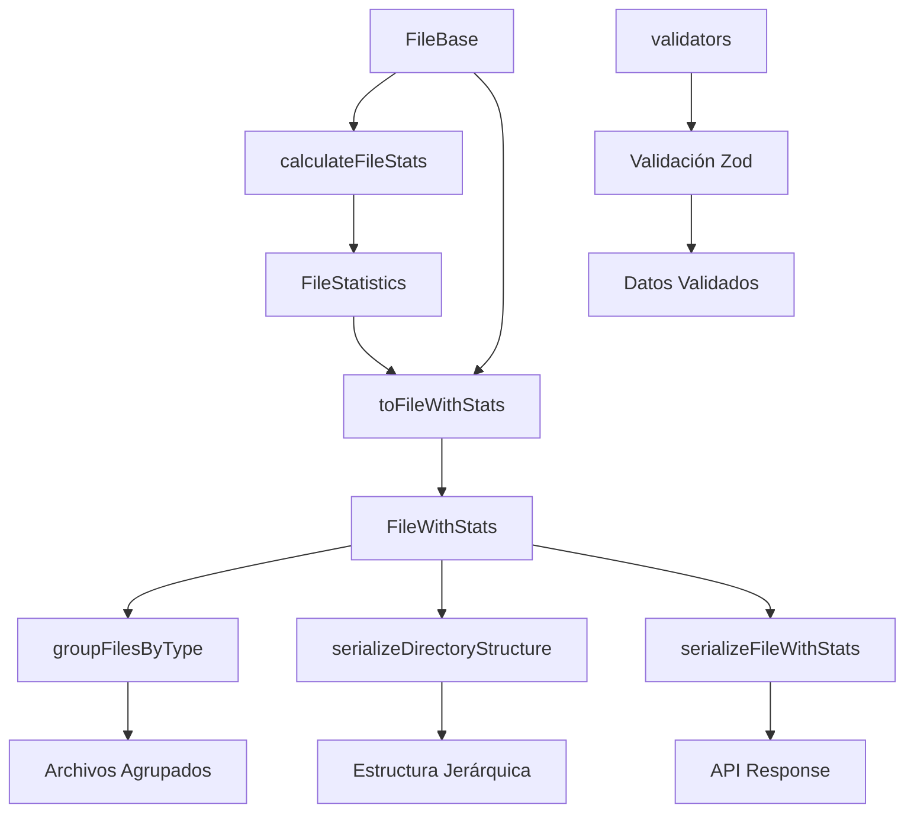

# 📁 Transformador File

**Transformaciones y validaciones para la entidad File en el sistema de gestión de archivos.**
✅ MIGRADO A DRIZZLE - Enero 2025

## Visión General

El transformador File gestiona archivos del sistema con capacidades de análisis de metadatos, clasificación por tipo, cálculo de estadísticas y organización jerárquica.

## Funcionalidades Principales

### 🔄 Transformaciones

- **toFileWithStats**: Enriquece archivos base con estadísticas calculadas
- **toFileWithStatsList**: Procesa listas de archivos con estadísticas

### 📊 Estadísticas Calculadas

- **formattedSize**: Tamaño legible para humanos (KB, MB, GB)
- **typeLabel**: Tipo de archivo legible (Imagen, Video, Documento)
- **iconName**: Ícono recomendado para el tipo de archivo
- **colorCode**: Color recomendado para el tipo de archivo
- **daysSinceModified**: Días desde la última modificación
- **daysSinceAccessed**: Días desde el último acceso
- **isRecent**: Indicador de archivo reciente (≤ 7 días)
- **isLarge**: Indicador de archivo grande (> 100MB)

### 🔒 Serialización y Estructura

- **serializeFileWithStats**: Serialización completa con estadísticas
- **serializeDirectoryStructure**: Estructura jerárquica de directorios
- **serializeFileGroupedStats**: Agrupación por tipo con totales

## Arquitectura



---

## Estructura y Relaciones

- **mappers.ts**: Mapeo a formatos de UI y búsqueda.
- **serializers.ts**: Serialización/deserialización, validación y extensión.
- **index.ts**: Barrel limpio, solo exporta funciones y tipos canónicos.

---

## Ejemplo de Uso

```typescript
import { transformFile } from '@/transformers/file/serializers';
import { toFileListItem } from '@/transformers/file/mappers';

const file = transformFile(rawFile);
const listItem = toFileListItem(file);
```

---

## Buenas Prácticas

- Usar **solo** los tipos y funciones canónicas exportadas.
- No modificar los tipos base ni duplicar lógica de transformación.
- Validar siempre los datos con los esquemas y funciones provistas.
- Mantener el barrel (`index.ts`) limpio y sin duplicados.

---

## Notas

- Todos los mapeos gestionan errores y validaciones de forma robusta.
- No existen tipos legacy ni duplicados en este módulo.

---

## Última revisión

- Fecha: 2025-06-10
- Estado: ✅ Auditado, sin errores TS, documentación y diagramas actualizados.
