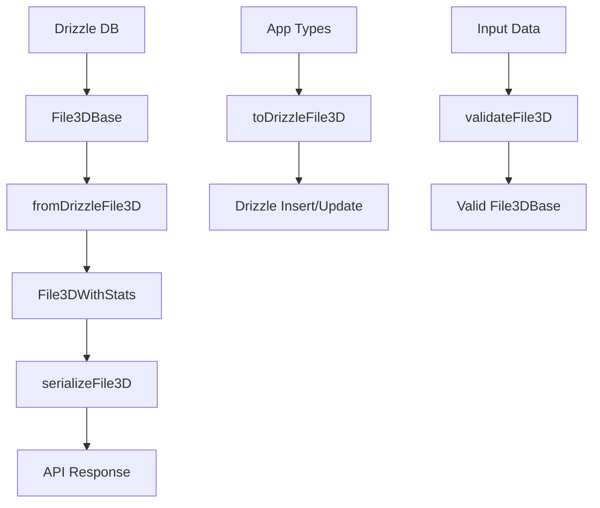

# Transformadores File3D

## 📋 Resumen

Este módulo contiene los transformadores para la entidad **File3D**, responsables de convertir datos entre los tipos de Drizzle/base de datos y los tipos de la aplicación.

## ✅ Estado de Migración

- **Estado**: ✅ MIGRADO A DRIZZLE
- **Dependencias de Prisma**: ❌ Eliminadas
- **Compatibilidad**: ✅ Total con tipos locales
- **Documentación**: ✅ Actualizada

## 🏗️ Estructura

```
file3d/
├── index.ts           # Punto de entrada y exports principales
├── mappers.ts         # Mapeo básico Drizzle ↔ App
├── serializers.ts     # Serialización y preparación para API
├── transformer.ts     # Transformación completa con estadísticas
├── validators.ts      # Validación de datos con Zod
├── schema.ts          # Esquemas Zod para validación
└── documentation.md   # Esta documentación
```

## 🔄 Flujo de Transformación



## 📚 API Principal

### Mappers (mappers.ts)

```typescript
// Conversión básica Drizzle → App
fromDrizzleFile3D(drizzle: DrizzleFile3D): File3D

// Conversión básica App → Drizzle  
toDrizzleFile3D(file: File3D): DrizzleFile3D
```

### Transformers (transformer.ts)

```typescript
// Transformación completa con estadísticas
fromDrizzleFile3D(drizzleFile3D: File3DBase): File3DWithStats

// Transformación de arrays
fromDrizzleFile3Ds(drizzleFile3Ds: File3DBase[]): File3DWithStats[]
```

### Serializers (serializers.ts)

```typescript
// Serialización para API
serializeFile3D(file3D: File3DWithStats): SerializedFile3D

// Serialización de arrays
serializeFile3Ds(file3Ds: File3DWithStats[]): SerializedFile3D[]
```

### Validators (validators.ts)

```typescript
// Validación de entrada
validateFile3D(data: unknown): File3DBase

// Validación de arrays
validateFile3Ds(data: unknown[]): File3DBase[]
```

## 🎯 Tipos Utilizados

### Base Types
- `File3DBase` - Tipo base de archivo 3D
- `File3DStatistics` - Estadísticas específicas de archivo 3D
- `File3DWithStats` - Tipo completo con estadísticas

### Estadísticas Incluidas
- `polygonCount` - Número de polígonos del modelo
- `textureSize` - Tamaño de texturas en bytes
- `format` - Formato del archivo 3D
- `vertexCount` - Número de vértices
- `materialCount` - Número de materiales

## 🔧 Uso Común

### Desde Controladores/Servicios

```typescript
import { fromDrizzleFile3D, serializeFile3D } from '@/transformers/file3d';

// Transformar datos de DB para uso en la app
const file3DWithStats = fromDrizzleFile3D(drizzleFile3D);

// Serializar para API response
const response = serializeFile3D(file3DWithStats);
```

### Desde Stores

```typescript
import { toDrizzleFile3D, validateFile3D } from '@/transformers/file3d';

// Validar datos de entrada
const validFile3D = validateFile3D(inputData);

// Preparar para inserción en DB
const drizzleData = toDrizzleFile3D(validFile3D);
```

## 🚨 Consideraciones Importantes

1. **Sin Dependencies Legacy**: No usar funciones deprecated de Prisma
2. **Estadísticas Dinámicas**: Las estadísticas se calculan dinámicamente
3. **Validación Estricta**: Siempre validar datos antes de transformar
4. **Logging**: Errores se registran automáticamente
5. **Performance**: Transformaciones optimizadas para grandes datasets

## 🔍 Migración Completada

### Eliminado
- ❌ Imports de Prisma
- ❌ Funciones `fromPrismaFile3D`
- ❌ Tipos `PrismaFile3D`
- ❌ Referencias legacy

### Agregado
- ✅ Tipos locales completos
- ✅ Validación con Zod
- ✅ Transformación con estadísticas
- ✅ Logging estructurado
- ✅ Documentación actualizada

## 📈 Próximos Pasos

1. **Implementar estadísticas reales** - Calcular polygonCount, vertexCount, etc.
2. **Optimizar transformaciones** - Cache para modelos grandes
3. **Agregar validación de formatos** - Soporte específico por formato 3D
4. **Testing exhaustivo** - Tests unitarios para todas las funciones