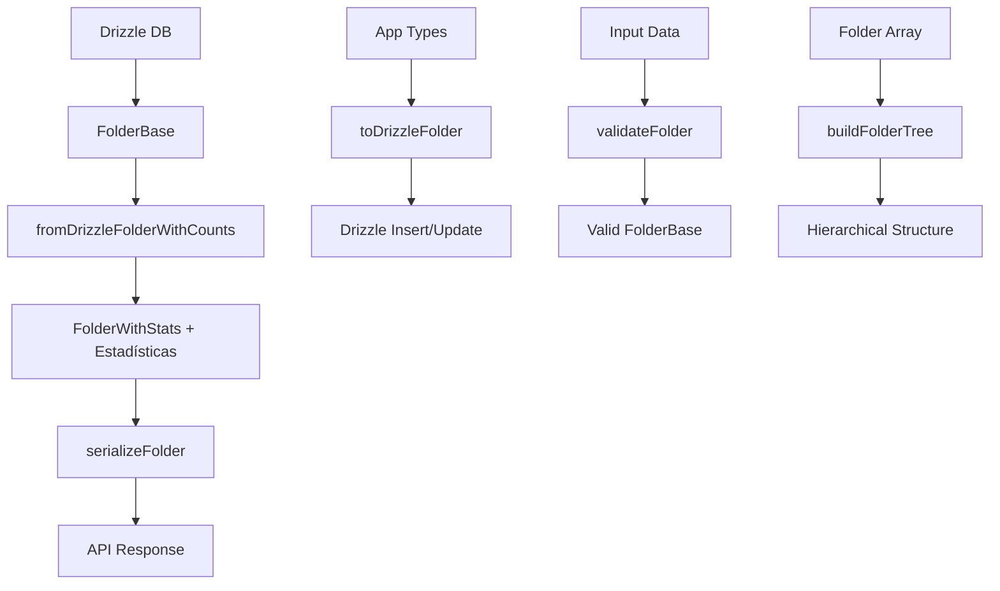

# Transformadores Folder

## 📋 Resumen

Este módulo contiene los transformadores para la entidad **Folder**, responsables de convertir datos entre los tipos de Drizzle/base de datos y los tipos de la aplicación. Implementa el patrón **EntityWithStats** para proporcionar análisis avanzado de organización, jerarquía y contenido de carpetas.

## ✅ Estado de Migración

- **Estado**: ✅ MIGRADO A DRIZZLE

- **Compatibilidad**: ✅ Total con tipos locales
- **Documentación**: ✅ Actualizada

## 🏗️ Estructura

```
folder/
├── index.ts           # Punto de entrada y exports principales
├── mappers.ts         # Mapeo avanzado Drizzle ↔ App
├── serializers.ts     # Serialización y preparación para API
├── transformer.ts     # Transformación completa con estadísticas
├── validators.ts      # Validación de datos con Zod
├── schema.ts          # Esquemas Zod para validación
└── documentation.md   # Esta documentación
```

## 🔄 Flujo de Transformación



## 📚 API Principal

### Mappers (mappers.ts)

```typescript
// Mapeo para creación
mapCreateFolderDataToDrizzle(data: FolderCreateInput): DrizzleFolderCreateInput

// Mapeo para actualización
mapUpdateFolderDataToDrizzle(data: FolderUpdateInput): DrizzleFolderUpdateInput

// Mapeo de opciones de búsqueda
mapFolderSearchOptionsToDrizzle(options: FolderSearchOptions): DrizzleFolderFindManyArgs

// Transformación completa a Drizzle
transformCompleteFolderToDrizzle(folder: FolderComplete): DrizzleFolder
```

### Transformers (transformer.ts)

```typescript
// Transformación principal con estadísticas
fromDrizzleFolderWithCounts(folderFromDrizzle: any): FolderWithStats | null

// Transformación de arrays
fromDrizzleFoldersWithCounts(drizzleFolders: any[]): FolderWithStats[]

// Utilidades de acceso
foldersToRecord(folders: FolderWithStats[]): Record<string, FolderWithStats>
getFolderById(folders: Record<string, FolderWithStats>, id: string): FolderWithStats | undefined

// Construcción de jerarquía
buildFolderTree(folders: FolderWithStats[]): FolderWithStats[]
```

### Serializers (serializers.ts)

```typescript
// Serialización para API
serializeFolder(folder: FolderWithStats): SerializedFolder

// Serialización de arrays
serializeFolders(folders: FolderWithStats[]): SerializedFolder[]

// Normalización de rutas
normalizeFolderPath(path: string): string
```

### Validators (validators.ts)

```typescript
// Validación de entrada
validateFolderCreate(data: unknown): FolderCreateInput
validateFolderUpdate(data: unknown): FolderUpdateInput
validateFolder(data: unknown): FolderBase

// Validación específica
validateFolderPath(path: string): string
validateFolderId(id: string): string
```

## 🎯 Tipos Utilizados

### Base Types
- `FolderBase` - Tipo base de carpeta
- `FolderStatistics` - Estadísticas avanzadas de carpeta
- `FolderWithStats` - Tipo completo con estadísticas

### Estadísticas Incluidas

#### 📊 Métricas de Jerarquía
- `hierarchyDepth` - Profundidad en el árbol de carpetas
- `totalDescendants` - Total de carpetas descendientes
- `directChildren` - Hijos directos

#### 📈 Métricas de Contenido
- `contentDiversity` - Variedad de contenido (0-100)
- `organizationScore` - Puntuación de organización (0-100)
- `totalItems` - Total de elementos

#### 📁 Distribución de Contenido
- `imageCount`, `videoCount`, `noteCount`, `documentCount`, `folderCount`

#### 📏 Métricas de Tamaño
- `formattedSize` - Tamaño formateado ("1.2 GB")
- `averageFileSize` - Tamaño promedio por archivo
- `largestFile` - Archivo más grande

#### 🏷️ Auto-tagging
- `autoTags` - Tags generados automáticamente
- `qualityGrade` - Calificación de calidad (A, B, C, D)

## 🔧 Sistema de Calidad

### Organization Score (0-100)

```typescript
// Cálculo del puntaje de organización:
// Base: 50 puntos
// + Estructura adecuada: +20
// + Subcarpetas organizadas: +15
// + Cantidad óptima de elementos: +10
// + Nomenclatura consistente: +15
// - Desorganización: -20
// - Jerarquía muy profunda: -15
```

### Quality Grade
- **A (85-100)**: Excelente organización
- **B (70-84)**: Buena organización
- **C (50-69)**: Organización regular
- **D (0-49)**: Necesita organización

## 🏷️ Auto-tagging Inteligente

### Tags de Jerarquía
- `root` - Carpetas de nivel raíz
- `deep` - Carpetas con profundidad >4
- `leaf` - Carpetas sin subcarpetas

### Tags de Contenido
- `images` - Predominantemente imágenes
- `videos` - Predominantemente videos
- `multimedia` - Mix de contenido
- `empty` - Sin contenido
- `large` - >50 elementos
- `massive` - >200 elementos

### Tags de Organización
- `well-organized` - Score ≥85
- `organized` - Score ≥70
- `needs-organization` - Score <50
- `consistent-naming` - Nomenclatura consistente

## 🔧 Uso Común

### Desde Controladores/Servicios

```typescript
import { fromDrizzleFolderWithCounts, serializeFolder } from '@/transformers/folder';

// Transformar datos de DB para uso en la app
const folderWithStats = fromDrizzleFolderWithCounts(drizzleFolder);

// Serializar para API response
const response = serializeFolder(folderWithStats);
```

### Desde Stores

```typescript
import { validateFolderCreate, mapCreateFolderDataToDrizzle } from '@/transformers/folder';

// Validar datos de entrada
const validFolder = validateFolderCreate(inputData);

// Preparar para inserción en DB
const drizzleData = mapCreateFolderDataToDrizzle(validFolder);
```

### Navegación Jerárquica

```typescript
import { buildFolderTree, foldersToRecord, getFolderById } from '@/transformers/folder';

// Construir árbol jerárquico
const tree = buildFolderTree(folders);

// Acceso optimizado O(1)
const foldersRecord = foldersToRecord(folders);
const folder = getFolderById(foldersRecord, 'folder-id');
```

## 🚨 Consideraciones Importantes

1. **Sin Dependencies Legacy**: No usar funciones deprecated de Prisma
2. **Estadísticas Dinámicas**: Las estadísticas se calculan en tiempo real
3. **Validación Estricta**: Siempre validar datos antes de transformar
4. **Logging**: Errores se registran automáticamente
5. **Performance**: Optimizado para datasets grandes con Record pattern

## 🔍 Migración Completada

### Eliminado
- ❌ Imports de Prisma
- ❌ Funciones `fromPrismaFolder*`
- ❌ Tipos `PrismaFolder*`
- ❌ Referencias legacy y aliases deprecated

### Agregado
- ✅ Tipos locales completos
- ✅ Validación exhaustiva con Zod
- ✅ Sistema de estadísticas avanzado
- ✅ Auto-tagging inteligente
- ✅ Optimizaciones de performance
- ✅ Logging estructurado
- ✅ Documentación actualizada

## 📈 Próximos Pasos

1. **Mejorar cálculo de estadísticas** - Agregar métricas más específicas
2. **Optimizar construcción de árbol** - Cache para jerarquías grandes
3. **Ampliar auto-tagging** - Más categorías y reglas inteligentes
4. **Testing exhaustivo** - Tests unitarios para todas las funciones
5. **Integración con índices** - Soporte para búsqueda avanzada