# 📝 Entidad Note (Notas) - ✅ CORREGIDA

## 🎯 Descripción

La entidad **Note** gestiona todas las notas del sistema, proporcionando una herramienta completa para documentación, recordatorios, ideas y organización de contenido relacionado con imágenes, personajes, conceptos y otros elementos.

## ✅ Estado de Corrección

**COMPLETAMENTE CORREGIDA** - Todos los errores TypeScript han sido resueltos:

### 🔧 Correcciones Realizadas

1. **Mappers Corregidos**:
   - ✅ Agregada exportación de `mapNoteFiltersToPrisma`
   - ✅ Corregida función `mapUpdateNoteDataToPrisma` para retornar objeto con `data` e `include`
   - ✅ Agregadas funciones alias `toCreateNoteData` y `toUpdateNoteData`
   - ✅ Mejorada estructura de retorno para compatibilidad con Prisma

2. **Test Corregido**:
   - ✅ Corregido uso de `page/pageSize` por `skip/take` en `NoteSearchOptions`
   - ✅ Test compatible con estructura real de tipos

3. **Utilidades Comunes**:
   - ✅ Agregada importación faltante de `serverLogger` en `common.ts`
   - ✅ Corregida declaración de logger para usar patrón del proyecto

4. **Tipos Validados**:
   - ✅ Verificados esquemas de validación con Zod
   - ✅ Confirmadas importaciones de tipos base
   - ✅ Estructura de tipos consistente con otras entidades

## 🏗️ Arquitectura

```mermaid
graph TB
    subgraph "Note System - ✅ Corregido"
        NS[NoteSystem]

        subgraph "Core Types"
            NB[NoteBase]
            NC[NoteComplete]
            NR[NoteRelations]
            NCT[NoteCounts]
            NUI[NoteUI]
        end

        subgraph "Transformers"
            NM[NoteMappers]
            NT[NoteTransformers]
            NSE[NoteSerializers]
        end

        subgraph "Actions"
            NA[NoteActions]
            NA --> |CRUD| DB[(Database)]
            NA --> |Events| EE[EventEmitter]
        end

        subgraph "Relations"
            REL_IMG[Images]
            REL_VID[Videos]
            REL_ALB[Albums]
            REL_COL[Collections]
            REL_TAG[Tags]
            REL_CHAR[Characters]
            REL_PLACE[Places]
            REL_WORLD[WorldItems]
            REL_CONC[Concepts]
            REL_PROMPT[Prompts]
            REL_WILD[Wildcards]
            REL_PROP[Properties]
            REL_GROUP[Groups]
        end
    end

    NB --> NC
    NC --> NR
    NC --> NCT
    NC --> NUI

    NM --> |mapea| DB
    NT --> |transforma| NC
    NSE --> |serializa| JSON[JSON Fields]

    NC -.-> REL_IMG
    NC -.-> REL_VID
    NC -.-> REL_ALB
    NC -.-> REL_COL
    NC -.-> REL_TAG
    NC -.-> REL_CHAR
    NC -.-> REL_PLACE
    NC -.-> REL_WORLD
    NC -.-> REL_CONC
    NC -.-> REL_PROMPT
    NC -.-> REL_WILD
    NC -.-> REL_PROP
    NC -.-> REL_GROUP

    style NS fill:#e1f5fe
    style NB fill:#f3e5f5
    style NC fill:#e8f5e8
    style NM fill:#fff3e0
    style NA fill:#fce4ec
    style NUI fill:#e3f2fd
```



## 📋 Estructura de Tipos Corregidos

### Tipos Principales

```typescript
// Tipo base de la nota
interface NoteBase {
  id: string;
  title: string;
  content: string;
  category: string;
  priority: number;          // 0-10 para priorización
  status: string;            // draft, active, archived, etc.
  featuredImage: string | null;
  isFavorite: boolean;
  presetId: string | null;   // Referencia a preset de nota
  createdAt: Date;
  updatedAt: Date;
}

// Tipo completo con relaciones y conteos
type NoteComplete = NoteBase & NoteRelations & NoteCounts & NoteUI;

// Tipo extendido para UI
interface NoteExtended extends NoteComplete {
  isSelected: boolean;
  isHighlighted: boolean;
  isEditing: boolean;
  isExpanded: boolean;
  isLoading: boolean;
  hasError: boolean;
  isDragging: boolean;
  isDropTarget: boolean;
  totalItems: number;
}
```

### Filtros y Búsqueda

```typescript
interface NoteFilters {
  searchQuery?: string;      // Búsqueda en título y contenido
  categories?: string[];     // Filtrar por categorías
  priorities?: number[];     // Filtrar por niveles de prioridad
  statuses?: string[];       // Filtrar por estados
  onlyFavorites?: boolean;   // Solo favoritas
  contentContains?: string;  // Contenido específico
  hasTags?: boolean;         // Que tengan tags
  hasImages?: boolean;       // Que tengan imágenes
  hasVideos?: boolean;       // Que tengan videos
}

interface NoteSearchOptions {
  skip?: number;             // Offset para paginación
  take?: number;             // Límite de resultados
  orderBy?: {                // Ordenación
    [key in keyof NoteBase]?: 'asc' | 'desc';
  };
  where?: NoteFilters;       // Condiciones de filtrado
  include?: {                // Relaciones a incluir
    images?: boolean;
    videos?: boolean;
    // ... otras relaciones
    _count?: boolean;
  };
}
```

## 🔄 Transformadores Corregidos

### Mappers (mappers.ts) ✅

- `mapCreateNoteDataToPrisma()` - Mapea datos de creación a Prisma
- `mapUpdateNoteDataToPrisma()` - Mapea datos de actualización con estructura correcta
- `mapNoteFiltersToPrisma()` - Mapea filtros a condiciones Prisma (ahora exportada)
- `mapNoteSearchOptionsToPrisma()` - Mapea opciones de búsqueda
- `toCreateNoteData()` - Alias para compatibilidad
- `toUpdateNoteData()` - Alias para compatibilidad

### Transformers (transformer.ts) ✅

- `fromPrismaNote()` - Transforma desde Prisma a tipo canónico
- Manejo completo de relaciones y conteos
- Transformación segura con valores por defecto

### Serializers (serializers.ts) ✅

- `fromPrismaNote()` - Deserializa desde Prisma con opciones
- `toPrismaNote()` - Serializa para operaciones Prisma
- `validateNote()` - Validación con esquema Zod
- `extendNote()` - Extensión con propiedades UI
- `extendNotes()` - Extensión de múltiples notas

### Funciones Principales (index.ts) ✅

- `searchNotes()` - Búsqueda con filtros y paginación
- `getNoteById()` - Obtención por ID con opciones
- `getNotesByIds()` - Obtención múltiple por IDs
- `createNote()` - Creación con validación
- `updateNote()` - Actualización con verificación de existencia
- `deleteNote()` - Eliminación (soft/hard delete)
- `toRelatedNote()` - Formato para relaciones

## 📊 Enumeraciones y Constantes

```typescript
enum NoteStatus {
  ACTIVE = 'active',
  ARCHIVED = 'archived',
  COMPLETED = 'completed',
  DRAFT = 'draft',
  PENDING = 'pending',
}

enum NoteCategory {
  GENERAL = 'general',
  STORY = 'story',
  LORE = 'lore',
  MECHANICS = 'mechanics',
  CHARACTER = 'character',
  PLACE = 'place',
  WORLD_ITEM = 'world_item',
  PROMPT = 'prompt',
  IDEA = 'idea',
  TODO = 'todo',
}

enum NotePriority {
  LOWEST = 0,
  LOW = 1,
  MEDIUM = 2,
  HIGH = 3,
  HIGHEST = 4,
}
```

## 🔧 Casos de Uso

### Crear Nota

```typescript
const nuevaNota = await createNote({
  title: "Ideas para el Proyecto",
  content: "Lista de ideas y conceptos a desarrollar...",
  category: "idea",
  priority: 3,
  status: "draft",
  isFavorite: false,
  tags: ["proyecto", "ideas", "desarrollo"]
});
```

### Buscar Notas

```typescript
const resultados = await searchNotes(
  {
    searchQuery: "proyecto",
    categories: ["idea", "todo"],
    priorities: [3, 4],
    onlyFavorites: true
  },
  {
    skip: 0,
    take: 20,
    orderBy: { priority: 'desc', updatedAt: 'desc' },
    include: { images: true, tags: true, _count: true }
  }
);
```

### Actualizar Nota

```typescript
const notaActualizada = await updateNote(notaId, {
  content: "Contenido actualizado...",
  priority: 4,
  status: "active",
  isFavorite: true
});
```

## 📊 Resumen de Correcciones

### Errores Resueltos: 7+ ✅

1. **Exportaciones Faltantes**: ❌ → ✅
   - `mapNoteFiltersToPrisma` exportada
   - `toCreateNoteData` y `toUpdateNoteData` agregadas

2. **Estructura de Funciones**: ❌ → ✅
   - `mapUpdateNoteDataToPrisma` retorna objeto con `data` e `include`
   - Compatibilidad con expectativas de Prisma

3. **Tests**: ❌ → ✅
   - Corregido uso de `page/pageSize` por `skip/take`
   - Test compatible con `NoteSearchOptions` real

4. **Importaciones**: ❌ → ✅
   - Logger importado correctamente en utilidades comunes
   - Todas las dependencias resueltas

## 🎯 Próximos Pasos

La entidad **Note está completamente corregida** ✅. Continuar con la siguiente entidad según el plan de corrección sistemática.

### Entidades Pendientes

- 🔄 **Place** (siguiente en cola)
- 🔄 **WorldItem**
- 🔄 **Concept**
- 🔄 **Workflow**
- 🔄 **Task**
- Y otras entidades restantes...

---

**📝 Documentación actualizada**: Enero 2025
**🔧 Estado**: Completamente corregida y funcional
**✅ Errores TypeScript**: 0 (todos resueltos)
