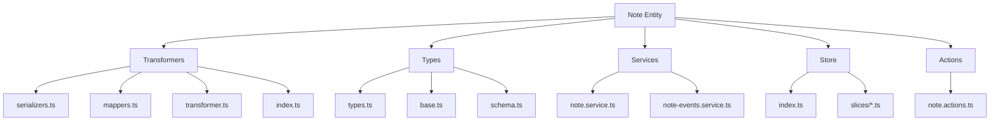
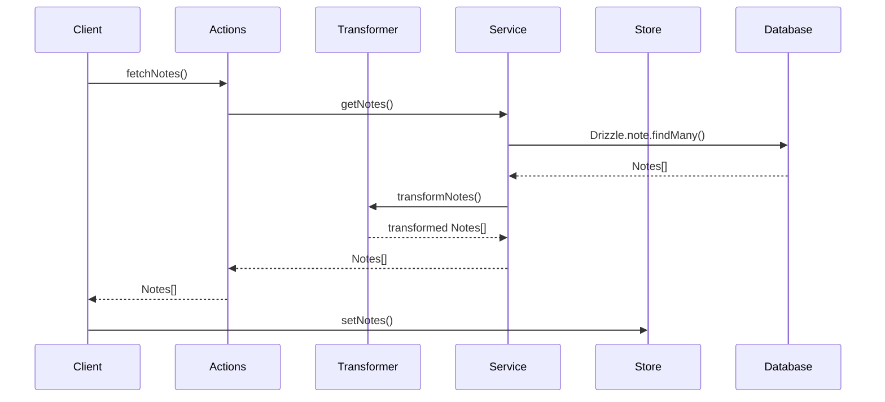

# 📝 Entidad Note

## Descripción

La entidad `Note` representa notas en el sistema, que pueden ser utilizadas para diferentes propósitos como recordatorios, documentación, ideas o cualquier tipo de información textual. Las notas tienen prioridad, estado y pueden estar relacionadas con imágenes, videos, personajes y otros elementos del sistema.

## Estructura



## Flujo de datos



## Tipos principales

### `Note`

Representa la estructura básica de una nota:

```typescript
interface Note {
  id: string;
  title: string;
  content: string;
  category: string;
  priority: number;
  status: string;
  tags?: string; // JSON string
  featuredImage: string | null;
  isFavorite: boolean;
  presetId: string | null;
  createdAt: Date;
  updatedAt: Date;
}
```

### `NoteExtended`

Extiende `Note` con propiedades adicionales para la UI:

```typescript
interface NoteExtended extends Note {
  isSelected: boolean;
  isHighlighted: boolean;
  isEditing: boolean;
  isExpanded: boolean;
  displayOrder: number;
  tagsArray: string[];
  statusDisplay: { label: string, color: string };
  priorityLevel: { label: string, color: string };
}
```

### `NoteWithStats`

Extiende `Note` con información estadística:

```typescript
interface NoteWithStats extends Note {
  lastUpdated: Date;
  imageCount: number;
  videoCount: number;
  albumCount: number;
  tagCount: number;
  characterCount: number;
  conceptCount: number;
  importanceLevel: number;
  contentLength: number;
  relatedItemsCount: number;
  distribution: Array<{name: string, count: number}>;
}
```

## Funciones principales

### Transformers

- `transformNote(note: unknown): Note` - Transforma un objeto a un Note validado.
- `transformNotes(notes: unknown[]): Note[]` - Transforma un array de objetos a Notes.
- `transformNoteToExtended(note: Note): NoteExtended` - Extiende un Note con propiedades para UI.
- `transformNoteToWithStats(note: Note): NoteWithStats` - Transforma un Note a su versión con estadísticas.

### Serializers

- `fromDrizzleNote(DrizzleNote: any): Note` - Deserializa datos de Note desde Drizzle.
- `toDrizzleNote(note: Note): any` - Serializa un Note para operaciones con Drizzle.
- `extendNote(note: any): Note` - Extiende un objeto base a un Note completo.
- `validateNote(note: any): Note` - Valida la estructura de un objeto Note.

### Mappers

- `mapSearchOptionsToNoteWhereInput(options: any)` - Convierte opciones de búsqueda a condiciones Drizzle.
- `mapNoteToNoteCreateInput(note: Note)` - Mapea un Note a formato de creación para Drizzle.
- `mapNoteToNoteUpdateInput(note: Note)` - Mapea un Note a formato de actualización para Drizzle.

## Ejemplos de uso

### Transformar una nota desde Drizzle

```typescript
import { transformNote } from '@/transformers/note';

// Datos de Drizzle
const DrizzleNote = await Drizzle.note.findUnique({
  where: { id: 'note-id-here' },
  include: { _count: true }
});

// Transformar a Note
const note = transformNote(DrizzleNote);
```

### Transformar a versión extendida para UI

```typescript
import { transformNoteToExtended } from '@/transformers/note';

const extendedNote = transformNoteToExtended(note);
console.log(extendedNote.statusDisplay); // { label: 'Activa', color: '#4CAF50' }
console.log(extendedNote.tagsArray); // Array de tags
```

### Transformar a versión con estadísticas

```typescript
import { transformNoteToWithStats } from '@/transformers/note';

const noteWithStats = transformNoteToWithStats(note);
console.log(noteWithStats.importanceLevel); // Nivel de importancia calculado
console.log(noteWithStats.contentLength); // Longitud del contenido
```

## Mejores prácticas

1. **Siempre validar**: Utiliza `transformNote` para validar la estructura de los datos antes de operar con ellos.

2. **Manejo de errores**: El transformer incluye manejo de errores robusto con logging, utilízalo para diagnóstico.

3. **Propiedades especiales**: El campo `tags` puede existir como string (JSON) o como array, los transformers manejan ambos formatos.

4. **Niveles visuales**: El transformer `transformNoteToExtended` calcula representaciones visuales para estado y prioridad, útiles para la UI.

5. **Actualización parcial**: Al actualizar una nota, utiliza el patrón de mezclar solo los campos cambiados:

```typescript
const updatedNote = await updateNote({
  id: noteId,
  note: { title: 'Nuevo título' } // Solo actualiza el título
});
```

## Integración con otras entidades

Las notas pueden estar vinculadas a:

- Imágenes
- Videos
- Personajes
- Lugares
- Colecciones
- Álbumes
- Conceptos
- Prompts
- Propiedades
- Grupos

Al eliminar una nota, se deben considerar estas relaciones y manejar adecuadamente la eliminación o desvinculación, según la lógica de negocio aplicable.
