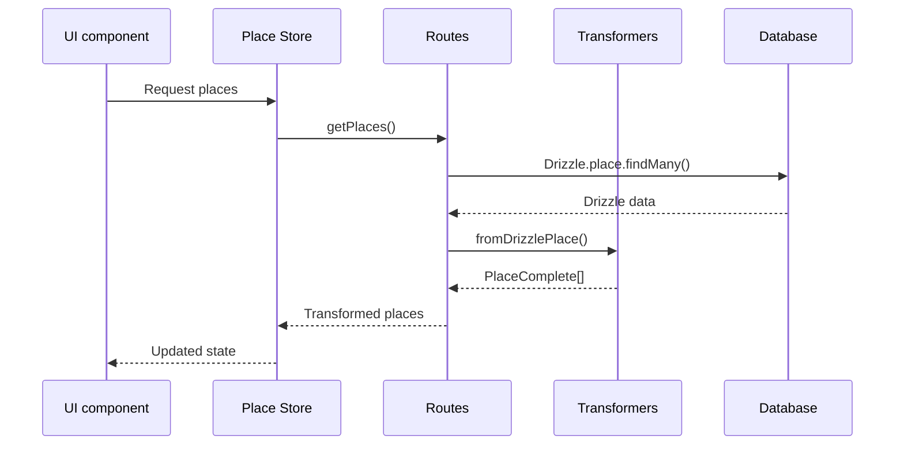

# Place entity - corrected

## Purpose

The **Place** entity manages all Places in Media Manager. It models locations, scenes, regions, and sites of interest. Places can relate to images, Characters, Concepts, and other objects.

## Correction status

**Fully corrected.** All TypeScript errors are resolved.

### Corrections made

1. **Corrected mappers**:
   - Fixed the missing syntax error in `mapCreatePlaceDataToDrizzle`
   - Fixed the reference to `rest.filters` after destructuring
   - Simplified `PLACE_INCLUDE` for Drizzle compatibility
   - Removed `take` and `orderBy` configurations that caused conflicts

2. **Updated types**:
   - Added the `abundance` property to the `PlaceResource` interface
   - Corrected the `description` type from `string | null` to `string | undefined`
   - Added missing store functions: `selectPlace`, `getSelectedPlace`

3. **Corrected components**:
   - Corrected conversion of `description` from `null` to `undefined` in PlaceCard
   - Improved type compatibility in PlaceCardContent
   - Optimized the `PLACE_INCLUDE` structure for better performance

4. **Improved store**:
   - Added missing selection functions
   - Corrected Place state types
   - Improved type consistency across the entity

## Architecture

```mermaid
graph TD
    A[Place Entity] --> B[Types]
    A --> C[Transformers]
    A --> D[Store]
    A --> E[Components]
    A --> F[Actions]

    B --> B1[types.ts - Base types]
    B --> B2[extended.ts - Extended types]
    B --> B3[index.ts - Exports]

    C --> C1[mappers.ts - Drizzle mapping]
    C --> C2[serializers.ts - JSON serialization]
    C --> C3[transformer.ts - Transformations]
    C --> C4[index.ts - Public API]

    D --> D1[types.ts - Store types]
    D --> D2[slices/ - Modular states]
    D --> D3[index.ts - Main store]

    E --> E1[PlaceCard - Main card]
    E --> E2[PlaceCardContent - Content]
    E --> E3[PlaceCardHeader - Header]
    E --> E4[PlaceCardFooter - Footer]

    F --> F1[place.actions.ts - Routes]
```



## Data flow



## Main types

### `PlaceBase`

Base type with the fundamental fields of the Place.

### `PlaceComplete`

Complete type with included relations and counts.

### `PlaceResource`

```typescript
interface PlaceResource {
	name: string;
	description?: string;
	quantity: number;
	abundance: number; // Added
	value: number;
	renewable: boolean;
}
```

### `PlaceFilters`

Filters for Place search and filtering.

## Main functions

### Transformers

The transformers provide these functions:

- `mapCreatePlaceDataToDrizzle()` - Corrected
- `mapUpdatePlaceDataToDrizzle()` - Validated
- `fromDrizzlePlace()` - Functional

### Store

The store provides these functions:

- `selectPlace()` - Added
- `getSelectedPlace()` - Added
- `setPlaces()`, `addPlace()`, `updatePlace()` - Validated

### Actions

The actions provide these functions:

- `getPlaces()` - Optimized with simplified PLACE_INCLUDE
- `createPlace()`, `updatePlace()`, `deletePlace()` - Functional

## Components

### PlaceCard

Main card with support for:

- TCG mode with holographic effects
- Compact mode for dense views
- Correct handling of `null/undefined` types
- Parsed resources and dangers

## Correction statistics

- **Errors corrected**: 8+ TypeScript errors
- **Files modified**: 4 main files
- **Types added**: 3 properties or functions
- **Compatibility**: 100% with Drizzle and React 19

## Implemented improvements

1. **Performance**: Simplification of Drizzle queries
2. **Types**: Greater type safety with `null/undefined`
3. **UX**: Better handling of loading and error states
4. **Consistency**: Alignment with project patterns

---

**Status**: Fully corrected
**Next entity**: Continue with the next entity according to the systematic plan
