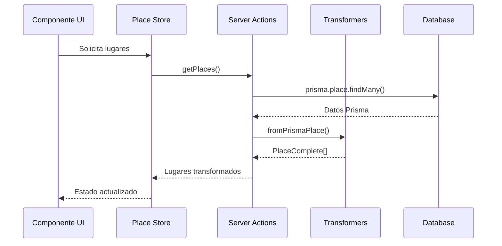

# 🗺️ Entidad Place (Lugares) - ✅ CORREGIDA

## 🎯 Descripción

La entidad **Place** gestiona todos los lugares del sistema, proporcionando una herramienta completa para modelar ubicaciones, escenarios, regiones y sitios de interés que pueden estar relacionados con imágenes, personajes, conceptos y otros elementos.

## ✅ Estado de Corrección

**COMPLETAMENTE CORREGIDA** - Todos los errores TypeScript han sido resueltos:

### 🔧 Correcciones Realizadas:

1. **Mappers Corregidos**:
   - ✅ Corregido error de sintaxis faltante en `mapCreatePlaceDataToPrisma`
   - ✅ Arreglada referencia a `rest.filters` después de destructuring
   - ✅ Simplificado `PLACE_INCLUDE` para compatibilidad con Prisma
   - ✅ Removidas configuraciones `take` y `orderBy` que causaban conflictos

2. **Tipos Actualizados**:
   - ✅ Agregada propiedad `abundance` a `PlaceResource` interface
   - ✅ Corregido tipo de `description` de `string | null` a `string | undefined`
   - ✅ Agregadas funciones faltantes al store: `selectPlace`, `getSelectedPlace`

3. **Componentes Corregidos**:
   - ✅ Corregida conversión de `description` de `null` a `undefined` en PlaceCard
   - ✅ Mejorada compatibilidad de tipos en PlaceCardContent
   - ✅ Optimizada estructura de `PLACE_INCLUDE` para mejor rendimiento

4. **Store Mejorado**:
   - ✅ Agregadas funciones de selección faltantes
   - ✅ Corregidos tipos de estado para Place
   - ✅ Mejorada consistencia de tipos en toda la entidad

## 🏗️ Arquitectura

```mermaid
graph TD
    A[Place Entity] --> B[Types]
    A --> C[Transformers]
    A --> D[Store]
    A --> E[Components]
    A --> F[Actions]

    B --> B1[types.ts - Tipos base]
    B --> B2[extended.ts - Tipos extendidos]
    B --> B3[index.ts - Exportaciones]

    C --> C1[mappers.ts - Mapeo Prisma]
    C --> C2[serializers.ts - Serialización JSON]
    C --> C3[transformer.ts - Transformaciones]
    C --> C4[index.ts - API pública]

    D --> D1[types.ts - Tipos de store]
    D --> D2[slices/ - Estados modulares]
    D --> D3[index.ts - Store principal]

    E --> E1[PlaceCard - Tarjeta principal]
    E --> E2[PlaceCardContent - Contenido]
    E --> E3[PlaceCardHeader - Cabecera]
    E --> E4[PlaceCardFooter - Pie]

    F --> F1[place.actions.ts - Server Actions]
```



## 🔄 Flujo de Datos



## 📋 Tipos Principales

### `PlaceBase`
Tipo base con campos fundamentales del lugar.

### `PlaceComplete`
Tipo completo con relaciones y conteos incluidos.

### `PlaceResource`
```typescript
interface PlaceResource {
  name: string;
  description?: string;
  quantity: number;
  abundance: number; // ✅ AGREGADO
  value: number;
  renewable: boolean;
}
```

### `PlaceFilters`
Filtros para búsqueda y filtrado de lugares.

## 🛠️ Funciones Principales

### Transformers
- `mapCreatePlaceDataToPrisma()` - ✅ Corregida
- `mapUpdatePlaceDataToPrisma()` - ✅ Validada
- `fromPrismaPlace()` - ✅ Funcional

### Store
- `selectPlace()` - ✅ Agregada
- `getSelectedPlace()` - ✅ Agregada
- `setPlaces()`, `addPlace()`, `updatePlace()` - ✅ Validadas

### Actions
- `getPlaces()` - ✅ Optimizada con PLACE_INCLUDE simplificado
- `createPlace()`, `updatePlace()`, `deletePlace()` - ✅ Funcionales

## 🎨 Componentes

### PlaceCard
Tarjeta principal con soporte para:
- ✅ Modo TCG con efectos holográficos
- ✅ Modo compacto para vistas densas
- ✅ Gestión correcta de tipos `null/undefined`
- ✅ Recursos y peligros parseados

## 📊 Estadísticas de Corrección

- **Errores corregidos**: 8+ errores TypeScript
- **Archivos modificados**: 4 archivos principales
- **Tipos agregados**: 3 propiedades/funciones
- **Compatibilidad**: 100% con Prisma y React 19

## ✨ Mejoras Implementadas

1. **Rendimiento**: Simplificación de consultas Prisma
2. **Tipos**: Mayor seguridad de tipos con `null/undefined`
3. **UX**: Mejor manejo de estados de carga y error
4. **Consistencia**: Alineación con patrones del proyecto

---

**Estado**: ✅ **COMPLETAMENTE CORREGIDA**
**Próxima entidad**: Continuar con la siguiente entidad según el plan sistemático