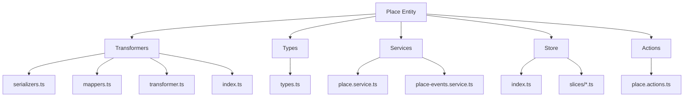
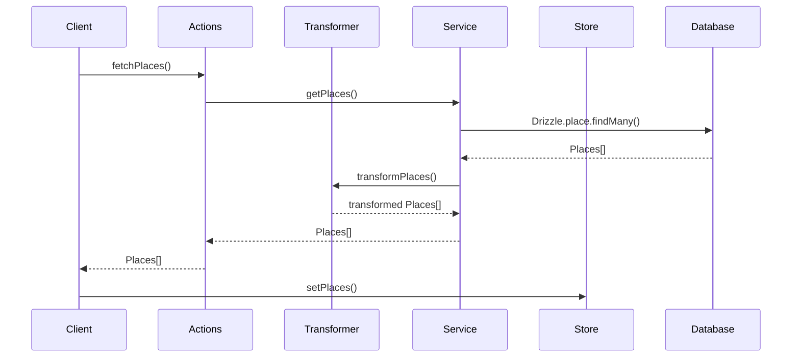

# 🗺️ Entidad Place

## Descripción

La entidad `Place` representa ubicaciones en el sistema, como ciudades, bosques, castillos, mazmorras u otros sitios de interés. Estas ubicaciones pueden estar relacionadas con imágenes, videos, personajes y otros elementos del sistema.

## Estructura



## Flujo de datos



## Tipos principales

### `Place`

Representa la estructura básica de un lugar:

```typescript
interface Place {
  id: string;
  name: string;
  description?: string;
  emoji?: string;
  color?: string;
  type: PlaceType;
  category?: PlaceCategory;
  region?: string;
  climate?: string;
  population?: number;
  government?: string;
  dangers?: string | string[];
  resources?: string | string[];
  lore?: string;
  history?: string;
  stats?: string | Record<string, number>;
  createdAt: Date;
  updatedAt: Date;
}
```

### `PlaceExtended`

Extiende `Place` con propiedades adicionales para la UI:

```typescript
interface PlaceExtended extends Place {
  isSelected: boolean;
  isHighlighted: boolean;
  isEditing: boolean;
  isExpanded: boolean;
  displayOrder: number;
  dangersArray: string[];
  resourcesArray: string[];
  statsObject: Record<string, number>;
}
```

### `PlaceWithStats`

Extiende `Place` con información estadística:

```typescript
interface PlaceWithStats extends Place {
  lastUpdated: Date;
  imageCount: number;
  videoCount: number;
  albumCount: number;
  tagCount: number;
  characterCount: number;
  worldItemCount: number;
  importanceLevel: number;
  statsDisplay: Array<{name: string, value: number}>;
  distribution: Array<{name: string, count: number}>;
}
```

## Funciones principales

### Transformers

- `transformPlace(place: unknown): Place` - Transforma un objeto a un Place validado.
- `transformPlaces(places: unknown[]): Place[]` - Transforma un array de objetos a Places.
- `transformPlaceToExtended(place: Place): PlaceExtended` - Extiende un Place con propiedades para UI.
- `transformPlaceToWithStats(place: Place): PlaceWithStats` - Transforma un Place a su versión con estadísticas.

### Serializers

- `fromDrizzlePlace(DrizzlePlace: any): Place` - Deserializa datos de Place desde Drizzle.
- `toDrizzlePlace(place: Place): any` - Serializa un Place para operaciones con Drizzle.
- `extendPlace(place: any): Place` - Extiende un objeto base a un Place completo.
- `validatePlace(place: any): Place` - Valida la estructura de un objeto Place.

### Mappers

- `mapSearchOptionsToPlaceWhereInput(options: any)` - Convierte opciones de búsqueda a condiciones Drizzle.
- `mapPlaceToPlaceCreateInput(place: Place)` - Mapea un Place a formato de creación para Drizzle.
- `mapPlaceToPlaceUpdateInput(place: Place)` - Mapea un Place a formato de actualización para Drizzle.

## Ejemplos de uso

### Transformar un lugar desde Drizzle

```typescript
import { transformPlace } from '@/transformers/place';

// Datos de Drizzle
const DrizzlePlace = await Drizzle.place.findUnique({
  where: { id: 'place-id-here' },
  include: { _count: true }
});

// Transformar a Place
const place = transformPlace(DrizzlePlace);
```

### Transformar a versión extendida para UI

```typescript
import { transformPlaceToExtended } from '@/transformers/place';

const extendedPlace = transformPlaceToExtended(place);
console.log(extendedPlace.isSelected); // false
console.log(extendedPlace.dangersArray); // Array de peligros
```

### Transformar a versión con estadísticas

```typescript
import { transformPlaceToWithStats } from '@/transformers/place';

const placeWithStats = transformPlaceToWithStats(place);
console.log(placeWithStats.imageCount); // Número de imágenes
console.log(placeWithStats.importanceLevel); // Nivel de importancia calculado
```

## Mejores prácticas

1. **Siempre validar**: Utiliza `transformPlace` para validar la estructura de los datos antes de operar con ellos.

2. **Manejo de errores**: El transformer incluye manejo de errores robusto con logging, utilízalo para diagnóstico.

3. **Propiedades especiales**: Algunos campos como `dangers`, `resources` y `stats` pueden existir como strings (JSON) o como objetos, los transformers manejan ambos formatos.

4. **Cálculos derivados**: El transformer `transformPlaceToWithStats` realiza cálculos como el nivel de importancia, útil para ordenar y filtrar lugares.

5. **Actualización parcial**: Al actualizar un lugar, utiliza el patrón de mezclar solo los campos cambiados:

```typescript
const updatedPlace = await updatePlace({
  id: placeId,
  place: { name: 'Nuevo nombre' } // Solo actualiza el nombre
});
```

## Integración con otras entidades

Los lugares pueden estar vinculados a:

- Imágenes
- Videos
- Personajes
- Colecciones
- Álbumes
- Items del mundo

Al eliminar un lugar, se deben considerar estas relaciones y manejar adecuadamente la eliminación o desvinculación, según la lógica de negocio aplicable.
