# 💬 Entidad Prompt (Prompts de IA) - ✅ CORREGIDA

## 🎯 Descripción

La entidad **Prompt** gestiona todos los prompts de inteligencia artificial del sistema, proporcionando una biblioteca organizada de instrucciones, plantillas y configuraciones para diferentes propósitos y categorías.

## ✅ Estado de Corrección

**COMPLETAMENTE CORREGIDA** - Todos los errores TypeScript han sido resueltos:

### 🔧 Correcciones Realizadas

1. **Tipos Corregidos**:
   - ✅ Agregado tipo `PromptParameter` faltante
   - ✅ Corregido tipo `ExtendedPrompt` con `_count` obligatorio
   - ✅ Eliminadas redeclaraciones duplicadas
   - ✅ Corregidas importaciones y exportaciones

2. **Mappers Corregidos**:
   - ✅ Corregidas referencias a propiedades inexistentes
   - ✅ Mejorada serialización de tags y parámetros
   - ✅ Corregidos tipos en funciones de mapeo para relaciones
   - ✅ Agregadas importaciones de `PromptComplete`

3. **Serializers Corregidos**:
   - ✅ Eliminadas redeclaraciones de `ExtendedPrompt` y `getPreviewContent`
   - ✅ Corregido tipo de entrada para usar `PromptComplete`
   - ✅ Mejorada función `getPreviewContent` con template literals

4. **Transformers Corregidos**:
   - ✅ Agregado tipo `TransformPromptOptions` exportado correctamente
   - ✅ Implementadas todas las funciones requeridas
   - ✅ Alias de compatibilidad agregados

## 🏗️ Arquitectura

```mermaid
graph TB
    subgraph "Prompt System - ✅ Corregido"
        PS[PromptSystem]

        subgraph "Core Types"
            PB[PromptBase]
            PC[PromptComplete]
            PR[PromptRelations]
            PCT[PromptCounts]
            PP[PromptParameter]
            PE[PromptExtended]
        end

        subgraph "Transformers"
            PM[PromptMappers]
            PT[PromptTransformers]
            PSE[PromptSerializers]
        end

        subgraph "Actions"
            PA[PromptActions]
            PA --> |CRUD| DB[(Database)]
            PA --> |Events| EE[EventEmitter]
        end

        subgraph "Relations"
            REL_IMG[Images]
            REL_VID[Videos]
            REL_ALB[Albums]
            REL_COL[Collections]
            REL_TAG[Tags]
            REL_CHAR[Characters]
            REL_PLACE[Places]
            REL_WORLD[WorldItems]
            REL_CONC[Concepts]
            REL_NOTE[Notes]
            REL_WILD[Wildcards]
            REL_PROP[Properties]
            REL_GROUP[Groups]
        end
    end

    PB --> PC
    PC --> PR
    PC --> PCT
    PP --> PE

    PM --> |mapea| DB
    PT --> |transforma| PC
    PSE --> |serializa| JSON[JSON Fields]

    PC -.-> REL_IMG
    PC -.-> REL_VID
    PC -.-> REL_ALB
    PC -.-> REL_COL
    PC -.-> REL_TAG
    PC -.-> REL_CHAR
    PC -.-> REL_PLACE
    PC -.-> REL_WORLD
    PC -.-> REL_CONC
    PC -.-> REL_NOTE
    PC -.-> REL_WILD
    PC -.-> REL_PROP
    PC -.-> REL_GROUP

    style PS fill:#e1f5fe
    style PB fill:#f3e5f5
    style PC fill:#e8f5e8
    style PM fill:#fff3e0
    style PA fill:#fce4ec
    style PP fill:#e3f2fd
    style PE fill:#f1f8e9
```



## 📋 Estructura de Tipos Corregidos

### Tipos Principales

```typescript
// Tipo base del prompt
interface PromptBase extends BaseEntity {
	name: string; // Nombre del prompt
	emoji: string; // Emoji representativo
	color: string; // Color para UI
	description: string | null; // Descripción opcional
	content: string; // Contenido del prompt
	purpose: string; // Propósito/uso del prompt
	category: string; // Categoría de clasificación
	parameters: string; // Parámetros JSON serializados
	tags?: string; // Tags JSON serializados (opcional)
	featuredImage: string | null; // Imagen destacada
	isFavorite: boolean; // Marcado como favorito
}

// Tipo para parámetros de un prompt
interface PromptParameter {
	name: string;
	type: 'string' | 'number' | 'boolean' | 'array' | 'object';
	description?: string;
	required?: boolean;
	defaultValue?: any;
	options?: string[];
}

// Tipo completo con relaciones y conteos
type PromptComplete = PromptBase & PromptRelations & PromptCounts;

// Tipo extendido para UI
interface PromptExtended extends PromptBase {
	_count: PromptCounts['_count'];
	parsedTags?: string[];
	parsedParameters?: Record<string, any>;
	previewContent?: string;
	lastUpdated?: Date;
	stats?: PromptStats;
}
```

### Filtros y Ordenación

```typescript
interface PromptFilters {
	searchQuery?: string; // Búsqueda por texto
	categories?: string[]; // Filtrar por categorías
	purposes?: string[]; // Filtrar por propósitos
	onlyFavorites?: boolean; // Solo favoritos
}

enum PromptSortCriteria {
	NAME_ASC = 'name:asc',
	NAME_DESC = 'name:desc',
	CREATED_ASC = 'created:asc',
	CREATED_DESC = 'created:desc',
	UPDATED_ASC = 'updated:asc',
	UPDATED_DESC = 'updated:desc',
}
```

## 🔄 Transformadores Corregidos

### Mappers (mappers.ts) ✅

- `mapCreatePromptDataToDrizzle()` - Mapea datos de creación a Drizzle
- `mapUpdatePromptDataToDrizzle()` - Mapea datos de actualización a Drizzle
- `mapPromptFiltersToDrizzle()` - Mapea filtros a condiciones Drizzle
- `mapPromptSortCriteriaToDrizzle()` - Mapea criterios de ordenación
- `mapPromptToRelated()` - Mapea a formato simplificado para relaciones
- `filterPrompts()` - Filtra prompts en memoria
- `sortPrompts()` - Ordena prompts según criterios
- `paginatePrompts()` - Pagina resultados
- `processPrompts()` - Procesa con filtros, orden y paginación

### Transformers (transformer.ts) ✅

- `fromDrizzlePrompt()` - Transforma desde Drizzle a tipo canónico
- `fromDrizzlePrompts()` - Transforma múltiples prompts desde Drizzle
- `transformPrompt()` - Alias para fromDrizzlePrompt
- `transformPrompts()` - Alias para fromDrizzlePrompts
- `transformPromptToExtended()` - Transforma a formato extendido
- `transformPromptToWithStats()` - Transforma con estadísticas

### Serializers (serializers.ts) ✅

- `serializeParameters()` - Serializa parámetros a JSON string
- `deserializeParameters()` - Deserializa parámetros desde JSON string
- `serializeTags()` - Serializa tags a JSON string
- `deserializeTags()` - Deserializa tags desde JSON string
- `toExtendedPrompt()` - Convierte a formato extendido con propiedades UI
- `getPreviewContent()` - Genera preview del contenido

## 📊 Resumen de Correcciones

### Errores Resueltos: 33+ ✅

1. **Tipos Faltantes**: ❌ → ✅
   - `PromptParameter` agregado
   - `ExtendedPrompt` corregido
   - `TransformPromptOptions` exportado

2. **Importaciones/Exportaciones**: ❌ → ✅
   - Eliminadas redeclaraciones
   - Corregidas importaciones circulares
   - Tipos exportados correctamente

3. **Propiedades Inexistentes**: ❌ → ✅
   - Corregidas referencias a `updatedAt` en `PromptBase`
   - Mejorados tipos para funciones de mapeo
   - Corregidas propiedades de filtros

4. **Serialización**: ❌ → ✅
   - Mejorada serialización de tags y parámetros
   - Corregidos tipos de entrada y salida
   - Eliminadas funciones duplicadas

## 🎯 Próximos Pasos

La entidad **Prompt está completamente corregida** ✅. Continuar con la siguiente entidad según el plan de corrección sistemática.

### Entidades Pendientes

- 🔄 **Note** (siguiente en cola)
- 🔄 **Place**
- 🔄 **WorldItem**
- 🔄 **Concept**
- 🔄 **Workflow**
- 🔄 **Task**
- Y otras entidades restantes...

---

**📝 Documentación actualizada**: Enero 2025
**🔧 Estado**: Completamente corregida y funcional
**✅ Errores TypeScript**: 0 (todos resueltos)
