# Prompt entity (AI Prompts) - corrected

## Purpose

The **Prompt** entity manages all artificial intelligence Prompts in Media Manager. It provides an organized library of instructions, templates, and configurations for different purposes and categories.

## Correction status

**Fully corrected.** All TypeScript errors are resolved.

### Corrections made

1. **Corrected types**:
   - Added the missing `PromptParameter` type
   - Corrected the `ExtendedPrompt` type with required `_count`
   - Removed duplicate redeclarations
   - Corrected imports and exports

2. **Corrected mappers**:
   - Corrected references to nonexistent properties
   - Improved serialization of tags and parameters
   - Corrected types in mapping functions for relations
   - Added imports of `PromptComplete`

3. **Corrected serializers**:
   - Removed redeclarations of `ExtendedPrompt` and `getPreviewContent`
   - Corrected the input type to use `PromptComplete`
   - Improved the `getPreviewContent` function with template literals

4. **Corrected transformers**:
   - Added the `TransformPromptOptions` type, exported correctly
   - Implemented all required functions
   - Added compatibility aliases

## Architecture

```mermaid
graph TB
    subgraph "Prompt System - Corrected"
        PS[PromptSystem]

        subgraph "Core Types"
            PB[PromptBase]
            PC[PromptComplete]
            PR[PromptRelations]
            PCT[PromptCounts]
            PP[PromptParameter]
            PE[PromptExtended]
        end

        subgraph "Transformers"
            PM[PromptMappers]
            PT[PromptTransformers]
            PSE[PromptSerializers]
        end

        subgraph "Actions"
            PA[PromptActions]
            PA --> |CRUD| DB[(Database)]
            PA --> |Events| EE[EventEmitter]
        end

        subgraph "Relations"
            REL_IMG[Images]
            REL_VID[Videos]
            REL_ALB[Albums]
            REL_COL[Collections]
            REL_TAG[Tags]
            REL_CHAR[Characters]
            REL_PLACE[Places]
            REL_WORLD[WorldItems]
            REL_CONC[Concepts]
            REL_NOTE[Notes]
            REL_WILD[Wildcards]
            REL_PROP[Properties]
            REL_GROUP[Groups]
        end
    end

    PB --> PC
    PC --> PR
    PC --> PCT
    PP --> PE

    PM --> |maps| DB
    PT --> |transforms| PC
    PSE --> |serializes| JSON[JSON Fields]

    PC -.-> REL_IMG
    PC -.-> REL_VID
    PC -.-> REL_ALB
    PC -.-> REL_COL
    PC -.-> REL_TAG
    PC -.-> REL_CHAR
    PC -.-> REL_PLACE
    PC -.-> REL_WORLD
    PC -.-> REL_CONC
    PC -.-> REL_NOTE
    PC -.-> REL_WILD
    PC -.-> REL_PROP
    PC -.-> REL_GROUP

    style PS fill:#e1f5fe
    style PB fill:#f3e5f5
    style PC fill:#e8f5e8
    style PM fill:#fff3e0
    style PA fill:#fce4ec
    style PP fill:#e3f2fd
    style PE fill:#f1f8e9
```



## Corrected type structure

### Main types

```typescript
// Base Prompt type
interface PromptBase extends BaseEntity {
	name: string; // Prompt name
	emoji: string; // Representative emoji
	color: string; // Color for UI
	description: string | null; // Optional description
	content: string; // Prompt content
	purpose: string; // Prompt purpose or use
	category: string; // Classification category
	parameters: string; // Serialized JSON parameters
	tags?: string; // Serialized JSON tags (optional)
	featuredImage: string | null; // Featured image
	isFavorite: boolean; // Marked as favorite
}

// Type for Prompt parameters
interface PromptParameter {
	name: string;
	type: 'string' | 'number' | 'boolean' | 'array' | 'object';
	description?: string;
	required?: boolean;
	defaultValue?: any;
	options?: string[];
}

// Complete type with relations and counts
type PromptComplete = PromptBase & PromptRelations & PromptCounts;

// Extended type for UI
interface PromptExtended extends PromptBase {
	_count: PromptCounts['_count'];
	parsedTags?: string[];
	parsedParameters?: Record<string, any>;
	previewContent?: string;
	lastUpdated?: Date;
	stats?: PromptStats;
}
```

### Filters and sorting

```typescript
interface PromptFilters {
	searchQuery?: string; // Text search
	categories?: string[]; // Filter by categories
	purposes?: string[]; // Filter by purposes
	onlyFavorites?: boolean; // Favorites only
}

enum PromptSortCriteria {
	NAME_ASC = 'name:asc',
	NAME_DESC = 'name:desc',
	CREATED_ASC = 'created:asc',
	CREATED_DESC = 'created:desc',
	UPDATED_ASC = 'updated:asc',
	UPDATED_DESC = 'updated:desc',
}
```

## Corrected transformers

### Mappers (mappers.ts)

The mappers provide these functions:

- `mapCreatePromptDataToDrizzle()` - Maps create data to Drizzle
- `mapUpdatePromptDataToDrizzle()` - Maps update data to Drizzle
- `mapPromptFiltersToDrizzle()` - Maps filters to Drizzle conditions
- `mapPromptSortCriteriaToDrizzle()` - Maps sort criteria
- `mapPromptToRelated()` - Maps to a simplified format for relations
- `filterPrompts()` - Filters Prompts in memory
- `sortPrompts()` - Sorts Prompts by criteria
- `paginatePrompts()` - Paginates results
- `processPrompts()` - Processes with filters, order, and pagination

### Transformers (transformer.ts)

The transformers provide these functions:

- `fromDrizzlePrompt()` - Transforms from Drizzle to the canonical type
- `fromDrizzlePrompts()` - Transforms multiple Prompts from Drizzle
- `transformPrompt()` - Alias for fromDrizzlePrompt
- `transformPrompts()` - Alias for fromDrizzlePrompts
- `transformPromptToExtended()` - Transforms to extended format
- `transformPromptToWithStats()` - Transforms with statistics

### Serializers (serializers.ts)

The serializers provide these functions:

- `serializeParameters()` - Serializes parameters to a JSON string
- `deserializeParameters()` - Deserializes parameters from a JSON string
- `serializeTags()` - Serializes tags to a JSON string
- `deserializeTags()` - Deserializes tags from a JSON string
- `toExtendedPrompt()` - Converts to extended format with UI properties
- `getPreviewContent()` - Generates a content preview

## Correction summary

### Errors resolved: 33+

1. **Missing types**:
   - `PromptParameter` added
   - `ExtendedPrompt` corrected
   - `TransformPromptOptions` exported

2. **Imports and exports**:
   - Redeclarations removed
   - Circular imports corrected
   - Types exported correctly

3. **Nonexistent properties**:
   - References to `updatedAt` in `PromptBase` corrected
   - Types for mapping functions improved
   - Filter properties corrected

4. **Serialization**:
   - Serialization of tags and parameters improved
   - Input and output types corrected
   - Duplicate functions removed

## Next steps

The **Prompt** entity is fully corrected. Continue with the next entity according to the systematic correction plan.

### Pending entities

The pending entities are:

- **Note** (next in queue)
- **Place**
- **WorldItem**
- **Concept**
- **Workflow**
- **Task**
- Remaining entities

---

**Documentation updated**: January 2025
**Status**: Fully corrected and functional
**TypeScript errors**: 0 (all resolved)
