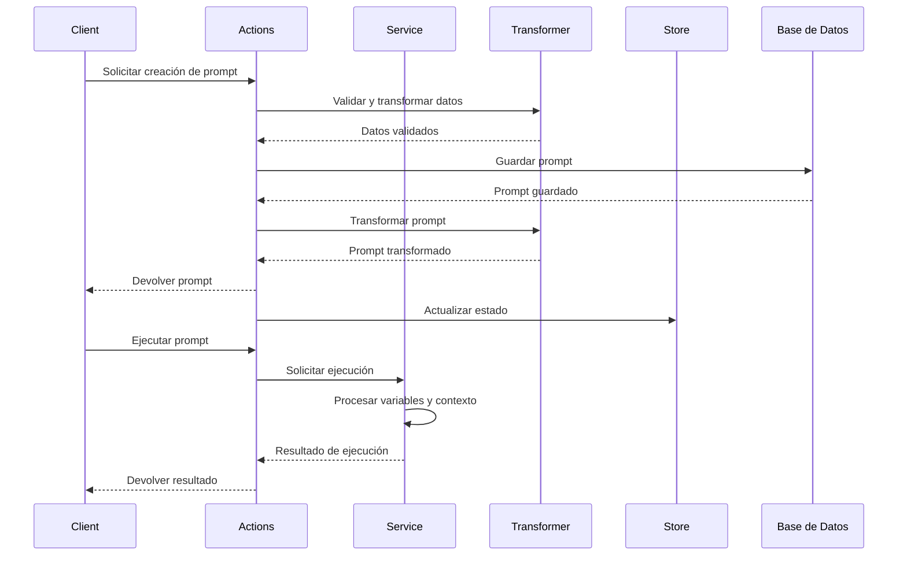

# Entidad Prompt

## Descripción

La entidad `Prompt` representa plantillas para la generación de contenido dentro del sistema. Los prompts pueden ser utilizados para generar texto, imágenes, código y otros tipos de contenido. Contienen parámetros configurables y pueden estar relacionados con otras entidades del sistema como conceptos, personajes, lugares, etc.

## Estructura

```mermaid
graph TD
    Prompt[Entidad Prompt]

    Prompt --> Transformers[Transformers]
    Prompt --> Types[Types]
    Prompt --> Services[Services]
    Prompt --> Store[Store]
    Prompt --> Actions[Actions]

    Transformers --> T1[transformPrompt]
    Transformers --> T2[transformPrompts]
    Transformers --> T3[transformPromptToExtended]
    Transformers --> T4[transformPromptToWithStats]
    Transformers --> T5[Serializers]
    Transformers --> T6[Mappers]

    Types --> Ty1[PromptBase]
    Types --> Ty2[PromptComplete]
    Types --> Ty3[PromptExtended]
    Types --> Ty4[PromptWithStats]
    Types --> Ty5[PromptExecutionParams]

    Services --> S1[PromptService]
    Services --> S2[PromptExecutionService]

    Store --> St1[PromptStore]
    Store --> St2[Core Slice]
    Store --> St3[UI Slice]
    Store --> St4[Filters Slice]

    Actions --> A1[createPrompt]
    Actions --> A2[updatePrompt]
    Actions --> A3[deletePrompt]
    Actions --> A4[getPrompt]
    Actions --> A5[getPrompts]
    Actions --> A6[executePrompt]
```



## Flujo de datos



## Tipos Principales

### `PromptBase`

Tipo base derivado del schema de Drizzle que define los campos fundamentales:

```typescript
export interface PromptBase {
	id: string;
	name: string;
	emoji: string;
	color: string;
	description: string | null;
	content: string;
	purpose: string;
	category: string;
	parameters: string; // String JSON que representa un objeto
	tags: string; // String JSON que representa un array
	featuredImage: string | null;
	isFavorite: boolean;
	createdAt: Date;
	updatedAt: Date;
}
```

### `PromptComplete`

Extiende PromptBase con campos JSON deserializados:

```typescript
export interface PromptComplete extends Omit<PromptBase, 'parameters' | 'tags'> {
	parameters: Record<string, any>; // Objeto deserializado
	tags: string[]; // Array deserializado
	_count?: PromptCounts;
	_relations?: PromptRelations;
	_ui?: PromptUI;
}
```

### `PromptExtended`

Añade propiedades UI adicionales para visualización:

```typescript
export interface PromptExtended extends PromptComplete {
	isSelected?: boolean;
	isHighlighted?: boolean;
	previewContent?: string;
	lastUpdated?: Date;
	importance?: number;
}
```

### `PromptWithStats`

Versión con estadísticas calculadas:

```typescript
export interface PromptWithStats extends PromptComplete {
	stats: {
		imageCount: number;
		videoCount: number;
		albumCount: number;
		tagCount: number;
		noteCount: number;
		conceptCount: number;
		characterCount: number;
		placeCount: number;
		worldItemCount: number;
		wildcardCount: number;
		totalContentItems: number;
		lastUpdated: Date;
		lastUsed: Date;
	};
}
```

## Transformadores Principales

### `transformPrompt`

Transforma un objeto a `PromptComplete`.

- **Entrada**: Cualquier objeto que tenga propiedades similares a un prompt.
- **Salida**: Objeto `PromptComplete` correctamente estructurado.
- **Opciones**:
  - `validateFields`: Valida los campos con Zod.
  - `deserializeFields`: Deserializa campos JSON.
  - `includeRelations`: Incluye relaciones asociadas.
  - `includeUI`: Incluye propiedades UI.
  - `includeStats`: Incluye estadísticas calculadas.

### `transformPrompts`

Transforma un array de objetos a `PromptComplete[]`.

### `transformPromptToExtended`

Transforma un prompt a su versión extendida para UI.

- **Entrada**: Objeto prompt.
- **Salida**: `PromptExtended` con propiedades adicionales para UI.

### `transformPromptToWithStats`

Transforma un prompt a su versión con estadísticas.

- **Entrada**: Objeto prompt.
- **Salida**: `PromptWithStats` con estadísticas calculadas.

## Serializadores y Deserializadores

### `deserializeParameters`

Deserializa el campo `parameters` de string JSON a objeto.

### `deserializeTags`

Deserializa el campo `tags` de string JSON a array de strings.

### `serializeParameters`

Serializa un objeto de parámetros a string JSON.

### `serializeTags`

Serializa un array de tags a string JSON.

## Store

El store de prompts utiliza Zustand y está organizado en slices:

1. **Core Slice**: Gestión del estado principal (prompts, selección, carga).
2. **UI Slice**: Estado de la interfaz (modales, modos de vista).
3. **Filters Slice**: Filtros y ordenación.

## Ejemplos de Uso

### Transformación básica

```typescript
import { transformPrompt } from '@/transformers/prompt';

// Datos crudos
const rawPrompt = {
	id: '123',
	name: 'Generador de personajes',
	emoji: '👤',
	color: '#3B82F6',
	description: 'Genera personajes para historias',
	content: 'Crea un personaje con las siguientes características: {{características}}',
	purpose: 'Worldbuilding',
	category: 'character',
	parameters: '{"características": "personalidad, apariencia, historia"}',
	tags: '["personaje", "creación", "worldbuilding"]',
	isFavorite: true,
	createdAt: new Date(),
	updatedAt: new Date(),
};

// Transformar
const prompt = transformPrompt(rawPrompt, {
	deserializeFields: true,
	validateFields: true,
});

console.log(prompt.parameters); // Objeto: { características: 'personalidad, apariencia, historia' }
console.log(prompt.tags); // Array: ['personaje', 'creación', 'worldbuilding']
```

### Obtener prompt con estadísticas

```typescript
import { transformPromptToWithStats } from '@/transformers/prompt';

const promptWithStats = transformPromptToWithStats(prompt);
console.log(promptWithStats.stats.imageCount); // Número de imágenes relacionadas
console.log(promptWithStats.stats.totalContentItems); // Total de elementos relacionados
```

## Integración en UI

El componente `PromptsExample` muestra cómo integrar los transformadores en una interfaz de usuario:

```tsx
import { transformPromptToWithStats } from '@/transformers/prompt';

// En componente React
const prompt = /* ... */;
const stats = transformPromptToWithStats(prompt);

return (
  <div>
    <h2>{prompt.name}</h2>
    <p>Elementos relacionados: {stats.stats.totalContentItems}</p>
    <p>Última actualización: {stats.stats.lastUpdated.toLocaleDateString()}</p>
  </div>
);
```
