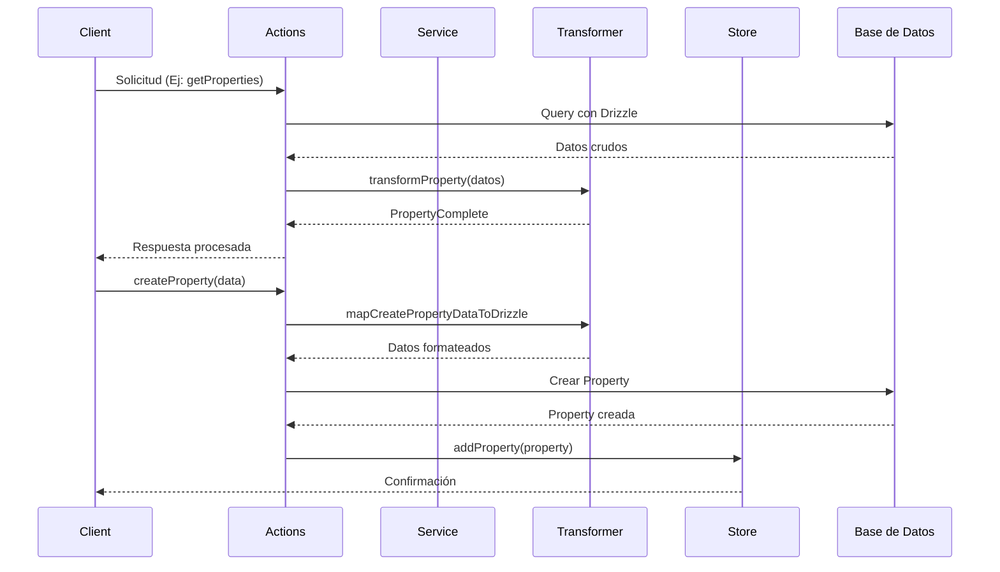

# Entidad Property

## Descripción

La entidad `Property` representa propiedades o atributos que pueden ser asociados con diversas entidades del sistema. Las propiedades permiten categorizar, filtrar y organizar el contenido de manera flexible, agregando metadatos personalizados a imágenes, videos, colecciones y otros elementos.

## Estructura

```mermaid
graph TD
    Property[Entidad Property]

    Property --> Transformers[Transformers]
    Property --> Types[Types]
    Property --> Services[Services]
    Property --> Store[Store]
    Property --> Actions[Actions]

    Transformers --> T1[transformProperty]
    Transformers --> T2[transformProperties]
    Transformers --> T3[transformPropertyToExtended]
    Transformers --> T4[transformPropertyToWithStats]
    Transformers --> T5[Serializers]
    Transformers --> T6[Mappers]

    Types --> Ty1[PropertyBase]
    Types --> Ty2[PropertyComplete]
    Types --> Ty3[PropertyExtended]
    Types --> Ty4[PropertyWithStats]
    Types --> Ty5[PropertyRelations]

    Services --> S1[PropertyService]
    Services --> S2[PropertySearchService]

    Store --> St1[PropertyStore]
    Store --> St2[Core Slice]
    Store --> St3[UI Slice]
    Store --> St4[Filters Slice]

    Actions --> A1[createProperty]
    Actions --> A2[updateProperty]
    Actions --> A3[deleteProperty]
    Actions --> A4[getProperty]
    Actions --> A5[getProperties]
    Actions --> A6[togglePropertyFavorite]
```



## Flujo de datos



## Transformadores

Los transformadores de Property gestionan la conversión entre diferentes formatos de datos:

### Transformadores Principales

- `transformProperty`: Convierte datos a formato PropertyComplete con validación
- `transformProperties`: Procesa arrays de propiedades
- `transformPropertyToExtended`: Agrega campos UI adicionales
- `transformPropertyToWithStats`: Agrega estadísticas de uso y relaciones

### Serializadores

- `fromDrizzleProperty`: Convierte objetos de Drizzle a formato interno
- `toDrizzleProperty`: Prepara datos para enviar a Drizzle
- `extendProperty`: Agrega campos calculados para UI

### Mappers

- `toCreatePropertyData`: Mapea datos para creación
- `toUpdatePropertyData`: Mapea datos para actualización
- `toSearchOptions`: Prepara opciones de búsqueda

## Uso en el Contexto de la Aplicación

Las propiedades se utilizan para:

1. **Etiquetado Avanzado**: Agregar metadatos personalizados a imágenes, videos y otros elementos
2. **Organización Flexible**: Categorizar contenido con propiedades específicas del dominio
3. **Búsqueda Mejorada**: Filtrar contenido por propiedades específicas
4. **Automatización**: Ejecutar acciones basadas en propiedades del contenido

## Ejemplo de Implementación

```tsx
// Componente de vista de propiedades
function PropertyView({ propertyId }) {
  const property = usePropertyStore(state => state.getProperty(propertyId));
  const propertyWithStats = transformPropertyToWithStats(property);

  return (
    <div className="property-view">
      <PropertyHeader property={propertyWithStats} />
      <PropertyStats stats={propertyWithStats.stats} />
      <RelatedItemsList property={propertyWithStats} />
    </div>
  );
}

// Crear una nueva propiedad
async function createNewProperty(data) {
  try {
    const newProperty = await createProperty(data);
    usePropertyStore.getState().addProperty(newProperty);
    return newProperty;
  } catch (error) {
    console.error('Error al crear propiedad:', error);
    throw error;
  }
}
```

## Relaciones con Otras Entidades

La entidad Property tiene relaciones con:

- Image
- Video
- Album
- Collection
- Tag
- Character
- Place
- WorldItem
- Concept
- Prompt
- Note
- Wildcard
- Group

## Tipos Relacionados

- `PropertyBase`: Estructura mínima de una propiedad
- `PropertyComplete`: Propiedad con todos sus campos y relaciones
- `PropertyExtended`: Incluye campos adicionales para UI
- `PropertyWithStats`: Incluye estadísticas calculadas
- `CreatePropertyData`: Datos para crear una propiedad
- `UpdatePropertyData`: Datos para actualizar una propiedad
