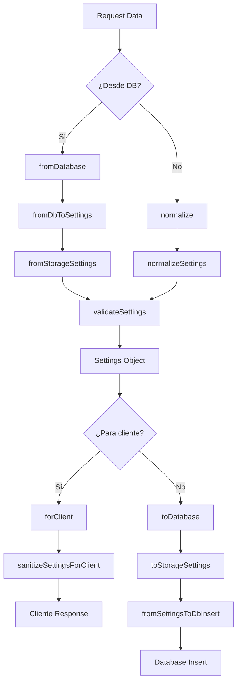

# Settings Transformer - Documentación

## Información General

**Módulo:** `transformers/settings`
**Entidad:** Settings (Configuración del sistema)
**Estado:** ✅ MIGRADO A DRIZZLE - Julio 2025
**Base de datos:** SQLite con Drizzle ORM

## Descripción

El transformer de Settings maneja la configuración global del sistema, incluyendo apariencia, notificaciones, privacidad y configuraciones avanzadas. Ha sido migrado completamente de Prisma a Drizzle con una arquitectura modular estándar.

## Estructura de Archivos

```text
src/transformers/settings/
├── mappers.ts          # Conversión entre formatos de datos DB ↔ App
├── serializers.ts      # Transformación y procesamiento de datos
├── validators.ts       # Validación con esquemas Zod
├── schema.ts          # Esquemas Zod y definición de tipos
├── transformer.ts     # API principal del transformer
├── index.ts          # Exportaciones y funciones legacy
├── internal.ts       # Implementaciones internas (legacy)
└── documentation.md  # Esta documentación
```

## Esquema de Base de Datos (Drizzle)

```typescript
// Tabla: Settings
{
  id: string (PK)
  theme: string (default: 'system')
  language: string (default: 'es')
  data: string (JSON - contiene el resto de configuraciones)
  profileId: string (FK)
}
```

## Tipos TypeScript

### Settings (Principal)

```typescript
interface Settings {
  appearance: {
    theme: 'light' | 'dark' | 'system';
    fontSize: number; // 12-24
    language: 'es' | 'en';
    reducedAnimations: boolean;
    highContrast: boolean;
  };
  notifications: {
    enabled: boolean;
    email: boolean;
    desktop: boolean;
    frequency: 'daily' | 'weekly' | 'monthly';
  };
  privacy: {
    shareUsageData: boolean;
    storeCookies: boolean;
    storeHistory: boolean;
  };
  advanced: {
    apiKey: string | null;
    devMode: boolean;
    experimentalFeatures: boolean;
  };
}
```

## API Principal

### Transformer (Recomendado)

```typescript
import { fromDatabase, toDatabase, normalize, forClient } from '@/transformers/settings/transformer';

// Desde base de datos a aplicación
const settings = fromDatabase(dbData);

// Desde aplicación a base de datos
const dbData = toDatabase(settings, profileId);

// Normalizar con valores por defecto
const normalized = normalize(partialSettings);

// Preparar para cliente (sin datos sensibles)
const clientSafe = forClient(settings);
```

### Mappers

```typescript
import { fromDbToSettings, fromSettingsToDbInsert } from '@/transformers/settings/mappers';

// Conversiones directas
const settings = fromDbToSettings(dbData);
const insertData = fromSettingsToDbInsert(settings, profileId);
```

### Validators

```typescript
import { validateSettings, validateSettingsUpdate } from '@/transformers/settings/validators';

// Validación completa
const validSettings = validateSettings(data);

// Validación de actualización parcial
const validUpdate = validateSettingsUpdate(partialData);
```

## Ejemplos de Uso

### Crear Nueva Configuración

```typescript
import { toDatabase, normalize } from '@/transformers/settings/transformer';

const defaultSettings = normalize({
  appearance: { theme: 'dark', language: 'es' }
});

const dbData = toDatabase(defaultSettings, userId);
// Guardar en base de datos...
```

### Actualizar Configuración

```typescript
import { toUpdateDatabase } from '@/transformers/settings/transformer';

const updateData = {
  appearance: { theme: 'light' },
  notifications: { enabled: false }
};

const dbUpdate = toUpdateDatabase(updateData);
// Aplicar actualización en base de datos...
```

### Cargar y Enviar al Cliente

```typescript
import { fromDatabase, forClient } from '@/transformers/settings/transformer';

// Cargar desde DB
const settings = fromDatabase(dbData);

// Sanitizar para cliente
const clientSettings = forClient(settings);
res.json(clientSettings);
```

## Validación con Zod

El transformer utiliza Zod para validación robusta:

```typescript
// Esquemas disponibles
import {
  settingsSchema,
  updateSettingsSchema,
  appearanceSchema,
  notificationsSchema
} from '@/transformers/settings/schema';

// Validación segura
import { safeValidateSettings } from '@/transformers/settings/validators';

const result = safeValidateSettings(data);
if (result.success) {
  console.log('Datos válidos:', result.data);
} else {
  console.error('Error:', result.error);
}
```

## Características Especiales

### 1. Campo JSON en Base de Datos

- `theme` y `language` se almacenan directamente
- Resto de configuraciones en campo `data` como JSON
- Conversión automática en mappers

### 2. Sanitización de Datos Sensibles

```typescript
import { forClient } from '@/transformers/settings/transformer';

// Oculta API keys automáticamente
const clientSafe = forClient(settings);
// settings.advanced.apiKey = "sk-..." → "***masked***"
```

### 3. Normalización Inteligente

```typescript
import { normalize } from '@/transformers/settings/transformer';

// Aplica valores por defecto para campos faltantes
const complete = normalize({ appearance: { theme: 'dark' } });
// Resultado: configuración completa con todos los campos
```

## Diagrama de Flujo



## Migración desde Prisma

### Cambios Principales

1. **Base de datos:** `@prisma/client` → `drizzle-orm`
2. **Esquemas:** Prisma schemas → Zod schemas
3. **Tipos:** Tipos Prisma → Tipos inferidos de Drizzle
4. **Estructura:** Archivo único → Arquitectura modular

### Funciones Migradas

| Legacy (Prisma) | Nuevo (Drizzle) | Ubicación |
|---|---|---|
| `fromPrismaSettings` | `fromStorageSettings` | `serializers.ts` |
| `toPrismaSettings` | `toStorageSettings` | `serializers.ts` |
| `mapSettingsUpdateToPrisma` | `fromSettingsUpdateToDb` | `mappers.ts` |

### Compatibilidad Legacy

Las funciones antiguas están disponibles con warnings de deprecación:

```typescript
// ⚠️ Deprecated - usa normalize()
import { deserializeSettings } from '@/transformers/settings';

// ⚠️ Deprecated - usa forClient()
import { serializeSettings } from '@/transformers/settings';
```

## Testing

### Validación de Datos

```typescript
import { validateSettings } from '@/transformers/settings/validators';

describe('Settings Validation', () => {
  it('should validate complete settings', () => {
    const settings = {
      appearance: { theme: 'dark', fontSize: 16, language: 'es', reducedAnimations: false, highContrast: false },
      notifications: { enabled: true, email: false, desktop: true, frequency: 'daily' },
      privacy: { shareUsageData: false, storeCookies: true, storeHistory: true },
      advanced: { apiKey: null, devMode: false, experimentalFeatures: false }
    };

    expect(() => validateSettings(settings)).not.toThrow();
  });
});
```

### Transformaciones

```typescript
import { fromDbToSettings, fromSettingsToDbInsert } from '@/transformers/settings/mappers';

describe('Settings Mappers', () => {
  it('should convert from DB to app format', () => {
    const dbData = {
      id: '1',
      theme: 'dark',
      language: 'es',
      data: JSON.stringify({ fontSize: 18, devMode: true }),
      profileId: 'user-1'
    };

    const settings = fromDbToSettings(dbData);
    expect(settings.appearance.theme).toBe('dark');
    expect(settings.appearance.fontSize).toBe(18);
    expect(settings.advanced.devMode).toBe(true);
  });
});
```

## Performance y Optimización

### Recomendaciones

1. **Usar validación segura** en endpoints públicos
2. **Cachear configuraciones** de usuario activas
3. **Batch updates** para múltiples cambios
4. **Sanitizar datos** antes de enviar al cliente

### Logging

El transformer incluye logging detallado:

```typescript
// Configurar nivel de log
import { serverLogger } from '@/lib/logger/server-logger';

const logger = serverLogger.withContext('SettingsTransformer');
logger.debug('Settings operation', { data });
```

---

**Última actualización:** Julio 2025
**Próximas mejoras:** Soporte para configuraciones por rol, temas personalizados avanzados
