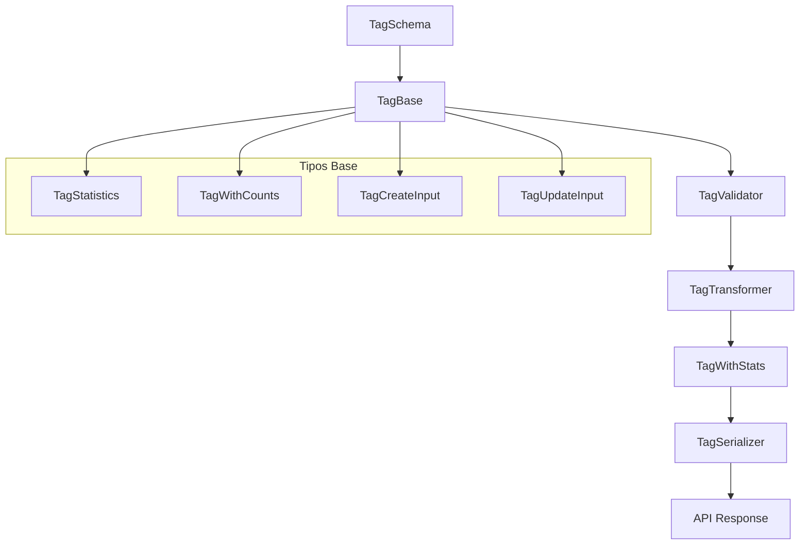

# 🏷️ Transformadores Tag

## Descripción

Transformadores para manejar la entidad **Tag**, permitiendo transformar datos desde la base de datos a estructuras optimizadas para la UI usando tipos locales de Drizzle.

## Arquitectura



## Componentes

### Schema (`schema.ts`)

- **ZodTagSchema**: Validación con Zod del modelo Tag base
- Derivado directamente del schema de Drizzle

### Validators (`validators.ts`)

- **validateTag**: Validación de objetos Tag
- **validateTagCreate**: Validación de datos de creación
- **validateTagUpdate**: Validación de datos de actualización

### Mappers (`mappers.ts`)

- **toTagWithStats**: Convierte TagBase + conteos → TagWithStats
- Calcula estadísticas automáticamente (totalRelations, usageDiversity, popularity, completenessScore)

### Serializers (`serializers.ts`)

- **serializeTag**: TagBase → JSON para API
- **serializeTagWithStats**: TagWithStats → JSON para API
- Optimizado para respuestas de red

### Transformer (`transformer.ts`)

- **transformTag**: Función principal de transformación
- Maneja datos con/sin conteos
- Genera estadísticas automáticamente

## Uso

```typescript
import { transformTag } from '@/transformers/tag';

// Con conteos de base de datos
const tagWithStats = await transformTag(tagData, {
	images: 25,
	videos: 8,
	collections: 3,
});

// Sin conteos (estadísticas vacías)
const tagBasic = await transformTag(tagData);
```

## Estadísticas Calculadas

- **totalRelations**: Suma de todas las relaciones del tag
- **usageDiversity**: Ratio de distribución entre tipos de entidades
- **popularity**: Score basado en totalRelations × diversityRatio
- **completenessScore**: Porcentaje de campos completados del perfil

- Tipos base migrados a definiciones locales
- Transformadores actualizados a lógica Drizzle
- Validaciones con Zod
- Documentación actualizada

## Archivos

- `index.ts` - Exportaciones principales
- `schema.ts` - Schema Zod
- `validators.ts` - Funciones de validación
- `mappers.ts` - Conversiones de tipos
- `serializers.ts` - Serialización para API
- `transformer.ts` - Transformador principal
- `documentation.md` - Esta documentación

---

_Migrado a Drizzle/tipos locales - 2025-01-27_
