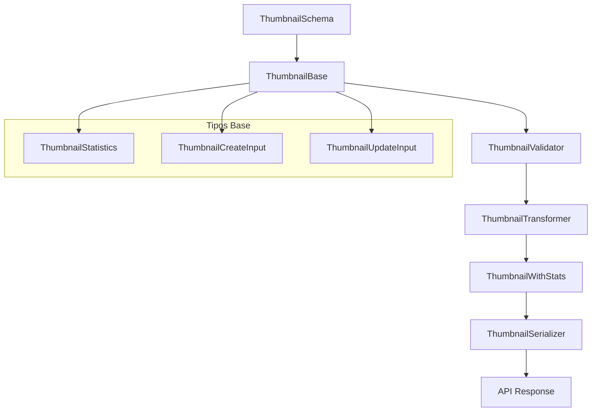

# 🖼️ Transformadores Thumbnail

## Descripción

Transformadores para manejar la entidad **Thumbnail**, permitiendo transformar datos desde la base de datos a estructuras optimizadas para la UI usando tipos locales de Drizzle.

## Arquitectura



## Componentes

### Schema (`schema.ts`)
- **ZodThumbnailSchema**: Validación con Zod del modelo Thumbnail base
- Derivado directamente del schema de Drizzle

### Validators (`validators.ts`)
- **validateThumbnail**: Validación de objetos Thumbnail
- **validateThumbnailCreate**: Validación de datos de creación
- **validateThumbnailUpdate**: Validación de datos de actualización

### Mappers (`mappers.ts`)
- **toThumbnailWithStats**: Convierte ThumbnailBase → ThumbnailWithStats
- Calcula estadísticas automáticamente (aspectRatio, compressionRatio, qualityScore, etc.)

### Serializers (`serializers.ts`)
- **serializeThumbnail**: ThumbnailBase → JSON para API
- **serializeThumbnailWithStats**: ThumbnailWithStats → JSON para API
- Optimizado para respuestas de red

### Transformer (`transformer.ts`)
- **transformThumbnail**: Función principal de transformación
- Maneja datos con/sin estadísticas
- Normalización automática de campos legacy

## Uso

```typescript
import { transformThumbnail } from '@/transformers/thumbnail';

// Con estadísticas calculadas
const thumbnailWithStats = await transformThumbnail(thumbnailData, {
  includeStats: true,
  usageCount: 42
});

// Sin estadísticas (más rápido)
const thumbnailBasic = await transformThumbnail(thumbnailData, {
  includeStats: false
});
```

## Estadísticas Calculadas

- **aspectRatio**: Ratio width/height del thumbnail
- **compressionRatio**: Estimación de compresión vs tamaño original
- **qualityScore**: Score de calidad (0-100) basado en resolución y formato
- **usageCount**: Número de veces que se ha usado este thumbnail
- **storageEfficiency**: Eficiencia de almacenamiento (calidad vs tamaño)

## Migración desde Prisma

✅ **Completado**: Eliminadas todas las referencias a Prisma
- Tipos base migrados a definiciones locales
- Transformadores actualizados a lógica Drizzle
- Validaciones con Zod
- Documentación actualizada

## Archivos

- `index.ts` - Exportaciones principales
- `schema.ts` - Schema Zod
- `validators.ts` - Funciones de validación
- `mappers.ts` - Conversiones de tipos
- `serializers.ts` - Serialización para API
- `transformer.ts` - Transformador principal
- `documentation.md` - Esta documentación

---

*Migrado a Drizzle/tipos locales - 2025-01-27*
