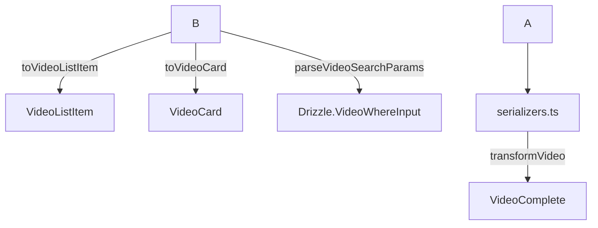

# Documentación de Transformadores de Video

## Descripción

Los transformadores de **Video** permiten mapear, serializar, deserializar y extender la entidad Video para distintos usos (UI, API, persistencia, estadísticas, etc.), asegurando siempre el uso de tipos canónicos y validación robusta.

---

## Diagrama de Flujo (Mermaid)



---

## Estructura y Relaciones

- **mappers.ts**: Mapeo a formatos de UI y búsqueda.
- **serializers.ts**: Serialización/deserialización, validación y extensión.
- **index.ts**: Barrel limpio, solo exporta funciones y tipos canónicos.

---

## Ejemplo de Uso

```typescript
import { transformVideo } from '@/transformers/video/serializers';
import { toVideoListItem } from '@/transformers/video/mappers';

const video = transformVideo(rawVideo);
const listItem = toVideoListItem(video);
```

---

## Buenas Prácticas

- Usar **solo** los tipos y funciones canónicas exportadas.
- No modificar los tipos base ni duplicar lógica de transformación.
- Validar siempre los datos con los esquemas y funciones provistas.
- Mantener el barrel (`index.ts`) limpio y sin duplicados.

---

## Notas

- Todos los mapeos gestionan errores y validaciones de forma robusta.
- No existen tipos legacy ni duplicados en este módulo.

---

## Última revisión

- Fecha: 2025-06-10
- Estado: ✅ Auditado, sin errores TS, documentación y diagramas actualizados.
