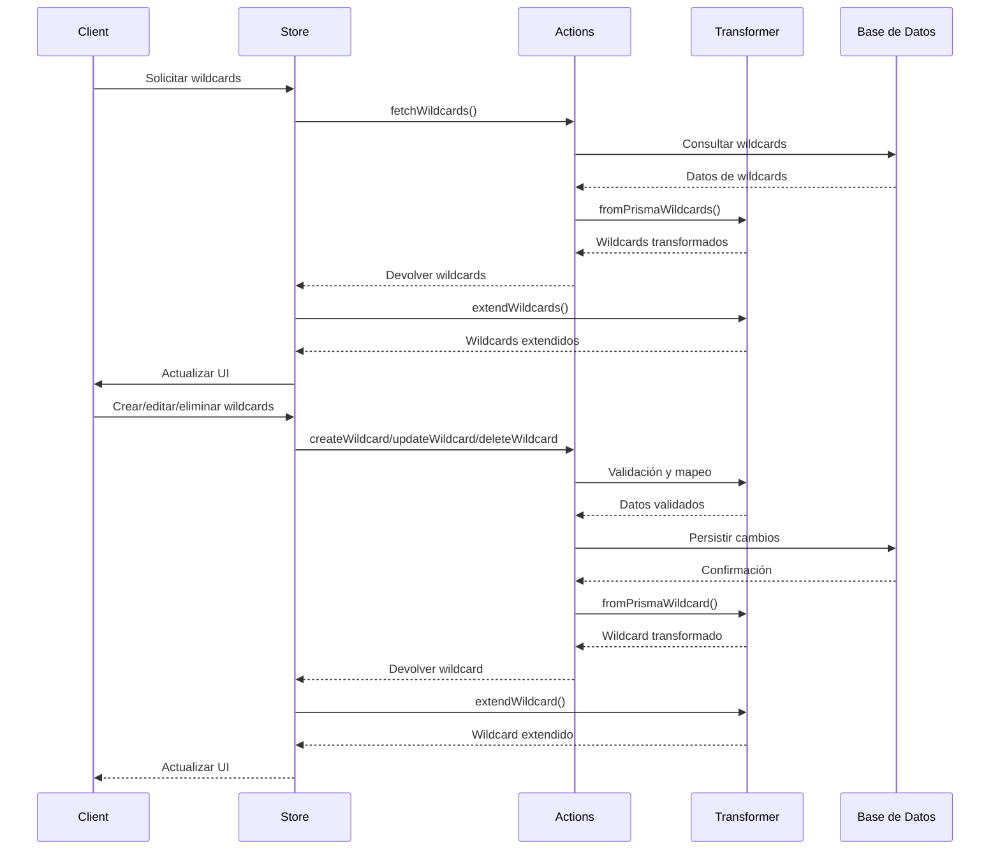

# Entidad Wildcard

## Descripción

La entidad `Wildcard` representa comodines o variables dinámicas que pueden ser utilizados en prompts y otros contextos dentro del sistema. Los wildcards pueden tener una estructura jerárquica (padres e hijos) y permiten generar contenido aleatorio o paramétrico para hacer los prompts más versátiles y reutilizables.

## Estructura

```mermaid
graph TD
    Wildcard[Entidad Wildcard]

    Wildcard --> Transformers[Transformers]
    Wildcard --> Types[Types]
    Wildcard --> Services[Services]
    Wildcard --> Store[Store]
    Wildcard --> Actions[Actions]

    Transformers --> T1[fromPrismaWildcard]
    
    Transformers --> T3[extendWildcard]
    Transformers --> T4[extendWildcards]
    Transformers --> T5[Serializers]
    Transformers --> T6[Mappers]

    Types --> Ty1[WildcardBase]
    Types --> Ty2[WildcardComplete]
    Types --> Ty3[WildcardExtended]
    Types --> Ty4[WildcardWithStats]
    Types --> Ty5[WildcardHierarchy]

    Services --> S1[WildcardService]
    Services --> S2[WildcardHierarchyService]

    Store --> St1[WildcardStore]
    Store --> St2[Core Slice]
    Store --> St3[UI Slice]
    Store --> St4[Filters Slice]
    Store --> St5[Hierarchy Slice]

    Actions --> A1[createWildcard]
    Actions --> A2[updateWildcard]
    Actions --> A3[deleteWildcard]
    Actions --> A4[getWildcard]
    Actions --> A5[getWildcards]
    Actions --> A6[getWildcardHierarchy]
    Actions --> A7[moveWildcard]
```



## Flujo de datos



## Tipos Principales

### `WildcardBase`

Tipo base derivado del esquema de la base de datos que define los campos fundamentales:

```typescript
export interface WildcardBase {
  id: string;
  name: string;
  emoji: string;
  color: string;
  description: string | null;
  shortcut: string | null;
  category: string | null;
  children: string; // JSON string de hijos
  featuredImage: string | null;
  isFavorite: boolean;
  parentId: string | null;
  createdAt: Date;
  updatedAt: Date;
}
```

### `WildcardComplete`

Extiende WildcardBase con campos JSON deserializados:

```typescript
export interface WildcardComplete extends WildcardBase {
  parsedChildren?: any[];
  _relations?: WildcardRelations;
  _count?: WildcardCounts;
  _ui?: WildcardUI;
}
```

### `WildcardExtended`

Añade propiedades UI adicionales para visualización:

```typescript
export interface WildcardExtended extends WildcardComplete {
  isSelected?: boolean;
  isHighlighted?: boolean;
  displayName?: string;
  isExpandable?: boolean;
  isExpanded?: boolean;
  shortcutDisplay?: string;
  lastUpdated?: Date;
}
```

### `WildcardWithStats`

Versión con estadísticas calculadas:

```typescript
export interface WildcardWithStats extends WildcardComplete {
  stats: {
    childCount: number;
    imageCount: number;
    videoCount: number;
    promptCount: number;
    totalContentItems: number;
    depth: number;
    usageCount: number;
    lastUpdated: Date;
  }
}
```

## Transformadores Principales

### `transformWildcard`

Transforma un objeto a `WildcardComplete`.

- **Entrada**: Cualquier objeto que tenga propiedades similares a un wildcard.
- **Salida**: Objeto `WildcardComplete` correctamente estructurado.
- **Opciones**:
  - `validateFields`: Valida los campos con Zod.
  - `deserializeFields`: Deserializa campos JSON (children).
  - `includeRelations`: Incluye relaciones asociadas.
  - `includeUI`: Incluye propiedades UI calculadas.
  - `includeStats`: Incluye estadísticas calculadas.

### `transformWildcards`

Transforma un array de objetos a `WildcardComplete[]`.

### `transformWildcardToExtended`

Transforma un wildcard a su versión extendida para UI.

- **Entrada**: Objeto wildcard.
- **Salida**: `WildcardExtended` con propiedades adicionales para UI.

### `transformWildcardToWithStats`

Transforma un wildcard a su versión con estadísticas.

- **Entrada**: Objeto wildcard.
- **Salida**: `WildcardWithStats` con estadísticas calculadas.

## Serializadores y Deserializadores

### `deserializeChildren`

Deserializa el campo `children` de string JSON a array de objetos.

### `serializeChildren`

Serializa un array de objetos hijos a string JSON.

## Store

El store de wildcards utiliza Zustand y está organizado en slices:

1. **Core Slice**: Gestión del estado principal (wildcards, selección, carga).
2. **UI Slice**: Estado de la interfaz (modales, modos de vista).
3. **Filters Slice**: Filtros y ordenación.
4. **Hierarchy Slice**: Gestión de la jerarquía de wildcards.

## Características Especiales

### Jerarquía de Wildcards

Los wildcards pueden tener una estructura jerárquica:

- Un wildcard puede tener un padre (`parentId`)
- Un wildcard puede tener múltiples hijos (`children`)
- Se pueden construir árboles de wildcards para organización
- Se pueden resolver recursivamente incluyendo subwildcards

### Resolución de Wildcards

Cuando se ejecuta un wildcard:

1. Se selecciona aleatoriamente un valor de entre sus opciones
2. Si el valor incluye referencias a otros wildcards, se resuelven recursivamente
3. Se puede limitar la profundidad de resolución para evitar ciclos infinitos

## Ejemplos de Uso

### Transformación básica

```typescript
import { transformWildcard } from '@/transformers/wildcard';

// Datos crudos
const rawWildcard = {
  id: '123',
  name: 'Nombres de personajes',
  emoji: '👤',
  color: '#3B82F6',
  description: 'Nombres aleatorios para personajes',
  shortcut: 'name',
  category: 'personajes',
  children: '[{"value":"Ana"},{"value":"Pedro"},{"value":"María"},{"value":"Juan"}]',
  isFavorite: true,
  parentId: null,
  createdAt: new Date(),
  updatedAt: new Date()
};

// Transformar con deserialización
const wildcard = transformWildcard(rawWildcard, {
  deserializeFields: true,
  validateFields: true
});

console.log(wildcard.parsedChildren); // Array de objetos: [{value:'Ana'}, {value:'Pedro'}, ...]
```

### Obtener wildcard con estadísticas

```typescript
import { transformWildcardToWithStats } from '@/transformers/wildcard';

const wildcardWithStats = transformWildcardToWithStats(wildcard);
console.log(wildcardWithStats.stats.childCount); // Número de hijos
console.log(wildcardWithStats.stats.depth); // Profundidad en la jerarquía
```

### Obtener wildcard con propiedades UI

```typescript
import { transformWildcardToExtended } from '@/transformers/wildcard';

const extendedWildcard = transformWildcardToExtended(wildcard);
console.log(extendedWildcard.displayName); // "👤 Nombres de personajes"
console.log(extendedWildcard.shortcutDisplay); // "[name]"
console.log(extendedWildcard.isExpandable); // true (tiene hijos)
```

## Integración con Prompts

Los wildcards se integran con prompts permitiendo contenido dinámico:

```
Genera una historia sobre {{character_name}} quien vive en {{location}} y trabaja como {{profession}}.
```

Donde `{{character_name}}`, `{{location}}` y `{{profession}}` son referencias a wildcards que se resolverán aleatoriamente al ejecutar el prompt.
