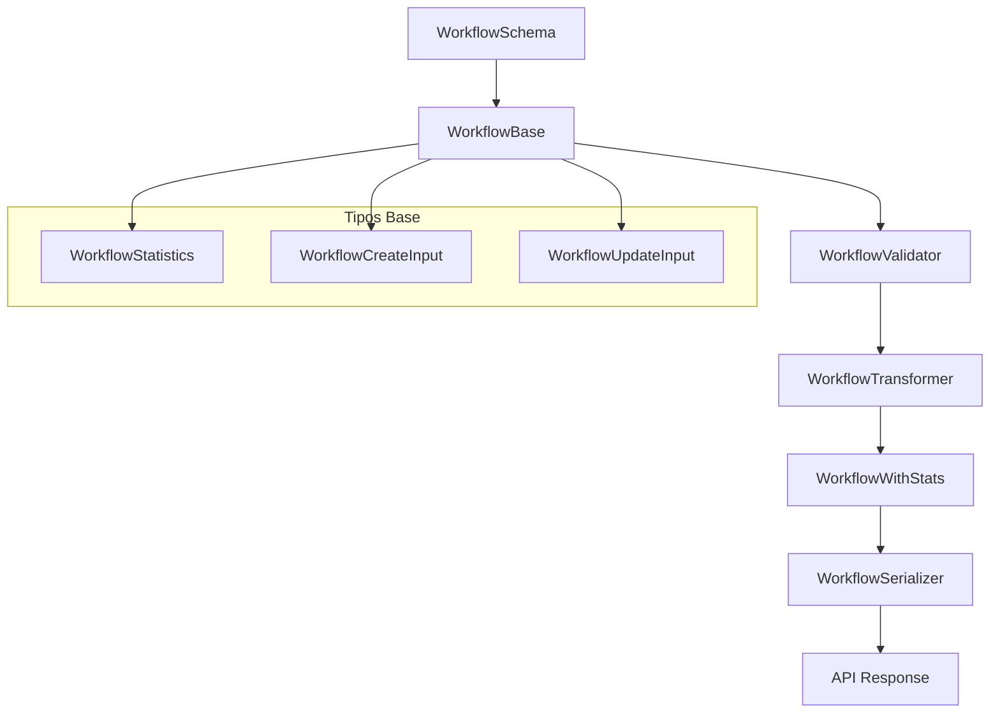

# ⚙️ Transformadores Workflow

## Descripción

Transformadores para manejar la entidad **Workflow**, permitiendo transformar datos desde la base de datos a estructuras optimizadas para la UI usando tipos locales de Drizzle.

## Arquitectura



## Componentes

### Schema (`schema.ts`)
- **ZodWorkflowSchema**: Validación con Zod del modelo Workflow base
- Derivado directamente del schema de Drizzle

### Validators (`validators.ts`)
- **validateWorkflow**: Validación de objetos Workflow
- **validateWorkflowCreate**: Validación de datos de creación
- **validateWorkflowUpdate**: Validación de datos de actualización

### Mappers (`mappers.ts`)
- **toWorkflowWithStats**: Convierte WorkflowBase → WorkflowWithStats
- Calcula estadísticas automáticamente (averageExecutionTime, successRate, etc.)

### Serializers (`serializers.ts`)
- **serializeWorkflow**: WorkflowBase → JSON para API
- **serializeWorkflowWithStats**: WorkflowWithStats → JSON para API
- Optimizado para respuestas de red

### Transformer (`transformer.ts`)
- **transformWorkflow**: Función principal de transformación
- Maneja datos con/sin estadísticas de ejecución
- Normalización automática de campos legacy

## Uso

```typescript
import { transformWorkflow } from '@/transformers/workflow';

// Con estadísticas de ejecución
const workflowWithStats = await transformWorkflow(workflowData, {
  includeStats: true,
  executionHistory: [
    { duration: 1200, success: true },
    { duration: 980, success: true },
    { duration: 1500, success: false }
  ]
});

// Sin estadísticas (más rápido)
const workflowBasic = await transformWorkflow(workflowData, {
  includeStats: false
});
```

## Estadísticas Calculadas

- **averageExecutionTime**: Tiempo promedio de ejecución en ms
- **successRate**: Porcentaje de ejecuciones exitosas
- **complexityScore**: Score de complejidad basado en número de pasos
- **popularityScore**: Score basado en número de ejecuciones
- **completenessScore**: Porcentaje de campos completados del perfil

## Migración desde Prisma

✅ **Completado**: Eliminadas todas las referencias a Prisma
- Tipos base migrados a definiciones locales
- Transformadores actualizados a lógica Drizzle
- Validaciones con Zod
- Documentación actualizada

## Archivos

- `index.ts` - Exportaciones principales
- `schema.ts` - Schema Zod
- `validators.ts` - Funciones de validación
- `mappers.ts` - Conversiones de tipos
- `serializers.ts` - Serialización para API
- `transformer.ts` - Transformador principal
- `documentation.md` - Esta documentación

---

*Migrado a Drizzle/tipos locales - 2025-01-27*
