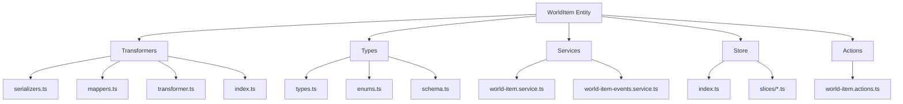
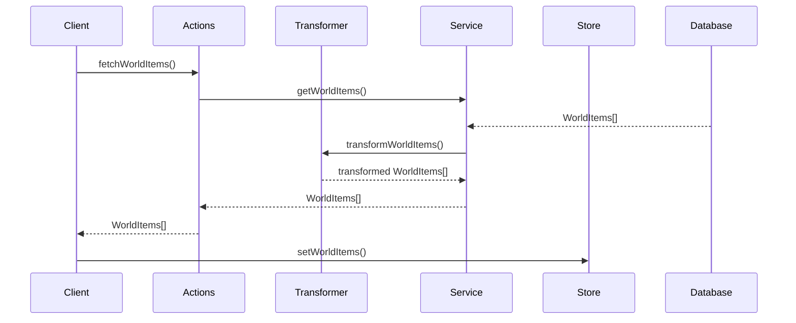

# 🏺 Entidad WorldItem

## Descripción

La entidad `WorldItem` representa objetos y elementos del mundo en el sistema, incluyendo herramientas, armas, vestimenta, reliquias y otros items. Estos objetos pueden tener propiedades como tipo, rareza, atributos y efectos, y pueden estar vinculados con imágenes, videos, personajes, lugares y otros elementos del sistema.

## Estructura



## Flujo de datos



## Tipos principales

### `WorldItem`

Representa la estructura básica de un objeto del mundo:

```typescript
interface WorldItem {
  id: string;
  name: string;
  description?: string;
  emoji?: string;
  color?: string;
  type: string;
  rarity: string;
  category?: string;
  attributes: string | WorldItemAttribute[];
  effects: string | WorldItemEffect[];
  requirements: string | WorldItemRequirement[];
  stats: string | Record<string, number>;
  origin: string;
  size: string;
  featuredImage?: string;
  isFavorite: boolean;
  sortBy: string;
  filters: string | WorldItemFilter[];
  createdAt: Date;
  updatedAt: Date;
}
```

### `WorldItemExtended`

Extiende `WorldItem` con propiedades adicionales para la UI:

```typescript
interface WorldItemExtended extends WorldItem {
  isSelected: boolean;
  isHighlighted: boolean;
  isEditing: boolean;
  isExpanded: boolean;
  displayOrder: number;
  attributesArray: WorldItemAttribute[];
  effectsArray: WorldItemEffect[];
  requirementsArray: WorldItemRequirement[];
  statsObject: Record<string, number>;
}
```

### `WorldItemWithStats`

Extiende `WorldItem` con información estadística:

```typescript
interface WorldItemWithStats extends WorldItem {
  lastUpdated: Date;
  imageCount: number;
  videoCount: number;
  albumCount: number;
  tagCount: number;
  characterCount: number;
  placeCount: number;
  rarityLevel: number;
  statsDisplay: Array<{name: string, value: number}>;
  distribution: Array<{name: string, count: number}>;
}
```

## Funciones principales

### Transformers

- `transformWorldItem(worldItem: unknown): WorldItem` - Transforma un objeto a un WorldItem validado.
- `transformWorldItems(worldItems: unknown[]): WorldItem[]` - Transforma un array de objetos a WorldItems.
- `transformWorldItemToExtended(worldItem: WorldItem): WorldItemExtended` - Extiende un WorldItem con propiedades para UI.
- `transformWorldItemToWithStats(worldItem: WorldItem): WorldItemWithStats` - Transforma un WorldItem a su versión con estadísticas.

### Serializers

- `fromDrizzleWorldItem(drizzleWorldItem: any): WorldItem` - Deserializa datos de WorldItem desde Drizzle.
- `toDrizzleWorldItem(worldItem: WorldItem): any` - Serializa un WorldItem para operaciones con Drizzle.
- `extendWorldItem(worldItem: any): WorldItem` - Extiende un objeto base a un WorldItem completo.
- `validateWorldItem(worldItem: any): WorldItem` - Valida la estructura de un objeto WorldItem.

### Mappers

- `mapSearchOptionsToWorldItemWhereInput(options: any)` - Convierte opciones de búsqueda a condiciones Drizzle.
- `mapWorldItemToWorldItemCreateData(worldItem: WorldItem)` - Mapea un WorldItem a formato de creación para Drizzle.
- `mapWorldItemToWorldItemUpdateData(worldItem: WorldItem)` - Mapea un WorldItem a formato de actualización para Drizzle.

## Ejemplos de uso

### Transformar un objeto del mundo desde Drizzle

```typescript
import { transformWorldItem } from '@/transformers/world-item';

// Datos de Drizzle
const drizzleWorldItem = await db.query.worldItems.findFirst({
  where: (worldItems, { eq }) => eq(worldItems.id, 'worlditem-id-here'),
  with: { _count: true }
});

// Transformar a WorldItem
const worldItem = transformWorldItem(drizzleWorldItem);
```

### Transformar a versión extendida para UI

```typescript
import { transformWorldItemToExtended } from '@/transformers/world-item';

const extendedWorldItem = transformWorldItemToExtended(worldItem);
console.log(extendedWorldItem.isSelected); // false
console.log(extendedWorldItem.attributesArray); // Array de atributos
```

### Transformar a versión con estadísticas

```typescript
import { transformWorldItemToWithStats } from '@/transformers/world-item';

const worldItemWithStats = transformWorldItemToWithStats(worldItem);
console.log(worldItemWithStats.imageCount); // Número de imágenes
console.log(worldItemWithStats.rarityLevel); // Nivel de rareza calculado
```

## Mejores prácticas

1. **Siempre validar**: Utiliza `transformWorldItem` para validar la estructura de los datos antes de operar con ellos.

2. **Manejo de errores**: El transformer incluye manejo de errores robusto con logging, utilízalo para diagnóstico.

3. **Propiedades especiales**: Algunos campos como `attributes`, `effects`, `requirements` y `stats` pueden existir como strings (JSON) o como objetos, los transformers manejan ambos formatos.

4. **Rareza numérica**: El transformer `transformWorldItemToWithStats` calcula un nivel numérico de rareza basado en el string, útil para ordenar y visualizar.

5. **Actualización parcial**: Al actualizar un WorldItem, utiliza el patrón de mezclar solo los campos cambiados:

```typescript
const updatedWorldItem = await updateWorldItem({
  id: worldItemId,
  worldItem: { name: 'Nuevo nombre' } // Solo actualiza el nombre
});
```

## Integración con otras entidades

Los objetos del mundo pueden estar vinculados a:

- Imágenes
- Videos
- Personajes
- Lugares
- Colecciones
- Álbumes
- Conceptos
- Propiedades
- Grupos

Al eliminar un WorldItem, se deben considerar estas relaciones y manejar adecuadamente la eliminación o desvinculación, según la lógica de negocio aplicable.
