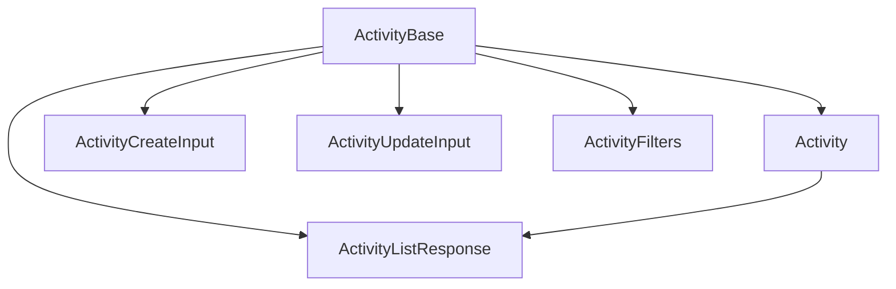

# Activity: canonical types and schemas

This module defines the **canonical types** and **Zod validation schemas** for the `Activity` entity. The types align with the domain model and project rules.

## Structure



The module uses these types:

- `ActivityBase`: Canonical type aligned with the database.
- `Activity`: Extended type for UI and relations.
- `ActivityCreateInput`, `ActivityUpdateInput`: Inputs for mutations.
- `ActivityListResponse`: Response for listings.
- `ActivitySchema`: Zod schema for validation.

## Migration notes

- **Legacy removed:** Only canonical types and enums are exported.
- **Validate with ActivitySchema before you persist.**

## Usage example

```ts
import type { Activity, ActivityCreateInput } from '@/types/entities/activity';
import type { ActivitySchema } from '@/types/entities/activity/types';

const created: ActivityCreateInput = { type: 'image_upload', description: 'Image upload' };
const validated = ActivitySchema.parse(created);
```

---

> Last update: 2025-06-18
> Owner: migration and cleanup of canonical types
