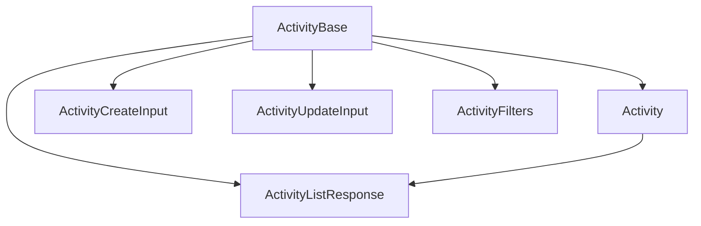

# ⚡ Activity: Tipos y Esquemas Canónicos

Este módulo define los **tipos canónicos** y **esquemas de validación Zod** para la entidad `Activity`, alineados con el modelo de dominio y las reglas del proyecto.

## 📦 Estructura



- `ActivityBase`: Tipo canónico alineado a la base de datos.
- `Activity`: Tipo extendido para UI y relaciones.
- `ActivityCreateInput`, `ActivityUpdateInput`: Inputs para mutaciones.
- `ActivityListResponse`: Respuesta para listados.
- `ActivitySchema`: Esquema Zod para validación.

## 🚨 Notas de migración

- **Legacy eliminado:** Solo se exportan tipos y enums canónicos.

- **Validar siempre con ActivitySchema antes de persistir.**

## 📝 Ejemplo de uso

```ts
import type { Activity, ActivityCreateInput } from '@/types/entities/activity';
import { ActivitySchema } from '@/types/entities/activity/types';

const nueva: ActivityCreateInput = { type: 'image_upload', description: 'Subida de imagen' };
const validada = ActivitySchema.parse(nueva);
```

---

> Última actualización: 2025-06-18
> Responsable: migración y limpieza de tipos canónicos
