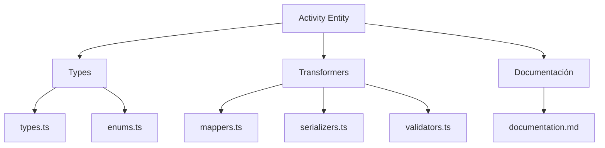
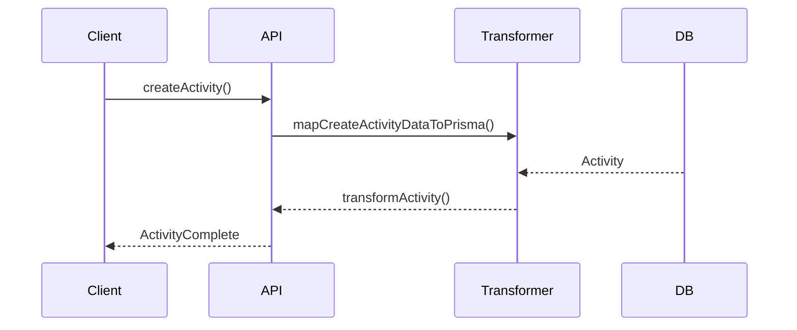

# 📝 Entidad Activity

## Descripción

La entidad `Activity` representa eventos, acciones o registros de actividad dentro del sistema, permitiendo auditar, rastrear y analizar el comportamiento de usuarios y procesos.

---

## Estructura



---

## Tipos principales

- `ActivityBase`, `ActivityComplete`, `ActivityCreateInput`, `ActivityUpdateInput`
- Filtros: `ActivityFilters`, `ActivitySearchOptions`, `ActivitySearchResult`

---

## Ejemplo de uso

```typescript
import { createActivity, updateActivity, searchActivities } from '@/transformers/activity/serializers';

const nuevaActividad = await createActivity({ type: 'login', userId: 'user-1' });
const actividades = await searchActivities({ filters: { type: 'login' } });
await updateActivity(nuevaActividad.id, { description: 'Inicio de sesión exitoso.' });
```

---

## Flujo de datos



---

## Mejores prácticas

- Usar siempre los tipos canónicos (`ActivityCreateInput`, `ActivityUpdateInput`, `ActivityComplete`).
- Validar los datos antes de crear/actualizar (`validateActivity`).
- Usar los mapeadores para relaciones complejas.
- Mantener la documentación y diagramas actualizados.

---

## Integración

Las actividades pueden asociarse a:

- Usuarios, imágenes, álbumes, colecciones, procesos automáticos, etc.

Al eliminar una actividad, revisar las relaciones para evitar referencias huérfanas.

---

> Última actualización: 2025-06-10
