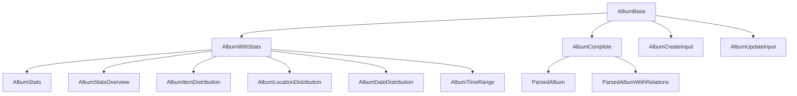

# 📸 Album: Tipos y Esquemas Canónicos

Este módulo define los **tipos canónicos** y **esquemas de validación Zod** para la entidad `Album`, alineados con el modelo de dominio y las reglas del proyecto.

## 📦 Estructura



- `AlbumBase`: Tipo canónico alineado a la base de datos.
- `AlbumWithStats`, `AlbumComplete`: Tipos enriquecidos con estadísticas y relaciones.
- `ParsedAlbum`, `ParsedAlbumWithRelations`: Versiones parseadas para UI.
- `AlbumStats`, `AlbumStatsOverview`: Tipos estadísticos.
- `AlbumCreateInput`, `AlbumUpdateInput`: Inputs para mutaciones.
- `AlbumSchema`: Esquema Zod para validación.

## 🚨 Notas de migración

- **Legacy eliminado:** Solo se exportan tipos y enums canónicos.
**
- **Validar siempre con AlbumSchema antes de persistir.**

## 📝 Ejemplo de uso

```ts
import type { AlbumBase, AlbumCreateInput } from '@/types/entities/album';
import { AlbumSchema } from '@/types/entities/album/types';

const nuevo: AlbumCreateInput = { name: 'Vacaciones', emoji: '📸', color: '#3b82f6', category: 'viajes' };
const validado = AlbumSchema.parse(nuevo);
```

---

> Última actualización: 2025-06-18
> Responsable: migración y limpieza de tipos canónicos
