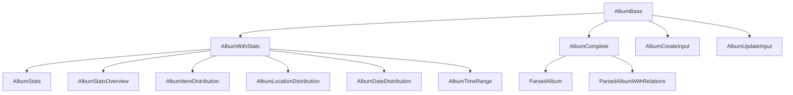

# Album: canonical types and schemas

This module defines the **canonical types** and **Zod validation schemas** for the `Album` entity. The types align with the domain model and project rules.

## Structure



The module uses these types:

- `AlbumBase`: Canonical type aligned with the database.
- `AlbumWithStats`, `AlbumComplete`: Types enriched with statistics and relations.
- `ParsedAlbum`, `ParsedAlbumWithRelations`: Parsed versions for UI.
- `AlbumStats`, `AlbumStatsOverview`: Statistical types.
- `AlbumCreateInput`, `AlbumUpdateInput`: Inputs for mutations.
- `AlbumSchema`: Zod schema for validation.

## Migration notes

- **Legacy removed:** Only canonical types and enums are exported.
- **Validate with AlbumSchema before you persist.**

## Usage example

```ts
import type { AlbumBase, AlbumCreateInput } from '@/types/entities/album';
import { AlbumSchema } from '@/types/entities/album/types';

const created: AlbumCreateInput = { name: 'Vacation', emoji: '📸', color: '#3b82f6', category: 'travel' };
const validated = AlbumSchema.parse(created);
```

---

> Last update: 2025-06-18
> Owner: migration and cleanup of canonical types
