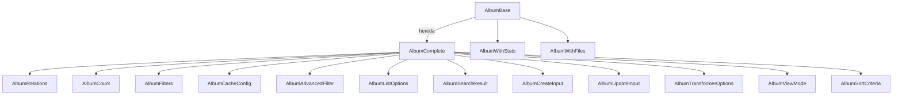

# Documentación de la Entidad Album

## Descripción

La entidad **Album** representa una colección ordenada de imágenes, videos u otros recursos multimedia. Permite agrupar y organizar elementos bajo un contexto temático, cronológico o personalizado.

---

## Diagrama de Flujo (Mermaid)



---

## Estructura y Relaciones

- **types.ts**: Tipos canónicos (`AlbumBase`, `AlbumComplete`, `AlbumCreateInput`, `AlbumUpdateInput`, etc.) y enums.
- **schema.ts**: Esquemas Zod para validación de datos y filtros.
- **mappers.ts**: Funciones para mapear datos de Album a formatos de UI y búsqueda.
- **serializers.ts**: Serialización/deserialización y validación robusta de datos.
- **transformer.ts**: Transformador principal, entrada unificada para conversión y extensión de Album.
- **index.ts**: Barrel limpio, solo exporta tipos y esquemas canónicos.

---

## Ejemplo de Uso

```typescript
import { transformAlbum, transformAlbumToWithStats } from '@/transformers/album/transformer';
import type { Album } from '@/types/entities/album';

const rawAlbum: Album = { /* ... */ };
const albumComplete = transformAlbum(rawAlbum);
const albumWithStats = transformAlbumToWithStats(albumComplete);
```

---

## Buenas Prácticas

- Usar **solo** los tipos canónicos (`AlbumBase`, `AlbumComplete`, `AlbumCreateInput`, `AlbumUpdateInput`).
- No extender ni modificar los tipos base fuera de este módulo.
- Utilizar los mappers y serializers para toda conversión de datos.
- Validar siempre los datos de entrada/salida con los esquemas Zod.
- Mantener el barrel (`index.ts`) limpio y sin duplicados.

---

## Notas

- Todos los campos de relaciones y conteos deben ser gestionados a través de los tipos y funciones canónicas.
- Los tipos legacy o duplicados han sido eliminados.
- El sistema de transformación y serialización incluye manejo robusto de errores y validación estricta.

---

## Última revisión

- Fecha: 2024-06-10
- Estado: ✅ Auditado, sin errores TS, documentación y diagramas actualizados.
