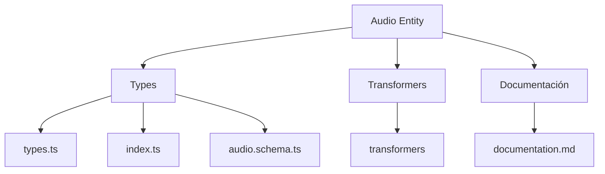
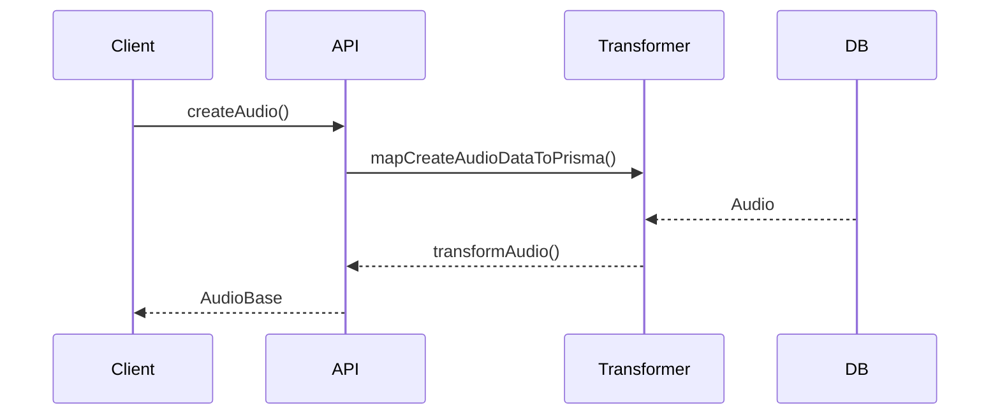

# 🎵 Entidad Audio

## Descripción

La entidad `Audio` representa archivos de audio como música, efectos sonoros, grabaciones de voz o cualquier otro contenido sonoro que pueda ser almacenado y gestionado en el sistema.

## Estructura



## Tipos principales

- `AudioBase`: Tipo base con campos fundamentales
- `AudioCreateInput`: Input para creación de archivos de audio
- `AudioUpdateInput`: Input para actualización de archivos de audio

## Ejemplo de uso

```typescript
import { createAudio, updateAudio, getAudio } from '@/transformers/audio';

// Crear un nuevo archivo de audio
const nuevoAudio = await createAudio({
  name: 'Música de ambiente',
  filePath: '/audio/ambiente.mp3',
  format: 'mp3',
  duration: 180, // duración en segundos (3 minutos)
  size: 4096000 // tamaño en bytes (4MB)
});

// Obtener un archivo de audio existente
const audio = await getAudio(nuevoAudio.id);

// Actualizar un archivo de audio existente
await updateAudio(nuevoAudio.id, {
  name: 'Música de ambiente - Remix',
  duration: 210 // nueva duración (3:30 minutos)
});
```

## Flujo de datos



## Mejores prácticas

- Usar siempre los tipos canónicos (`AudioCreateInput`, `AudioUpdateInput`, `AudioBase`).
- Validar los datos antes de crear/actualizar con el esquema Zod `audioSchema`.
- Soportar múltiples formatos de audio como MP3, WAV, FLAC, OGG, etc.
- Considerar metadatos adicionales como bitrate, canales, y metadatos ID3 para MP3.
- Implementar reproducción de audio en la interfaz de usuario cuando sea necesario.

## Integración

Los archivos de audio pueden integrarse con:

- Reproductores de audio en la aplicación
- Galerías multimedia
- Efectos sonoros para interfaces
- Contenido educativo o entretenimiento
- Narraciones o voces en off para contenido

## Migración a tipos canónicos

✅ Tipos canónicos implementados desde el inicio, documentación y diagrama actualizados.

---

> Última actualización: 2025-06-18