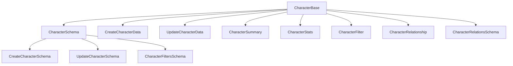

# 🧑‍🎤 Character: Tipos y Esquemas Zod

## 📄 Descripción

Este módulo define los **tipos base** y **esquemas de validación Zod** para la entidad `Character`, alineados con el modelo de dominio y las reglas del proyecto.

## 📦 Estructura



## 🏗️ Tipos principales

- `CharacterBase`: Tipo canónico alineado a la base de datos.
- `CreateCharacterData` / `UpdateCharacterData`: Tipos para operaciones CRUD.
- `CharacterSummary`, `CharacterStats`, `CharacterFilter`, `CharacterRelationship`: Tipos auxiliares para listados, stats y relaciones.

## 🛡️ Esquemas Zod

- `CharacterSchema`: Esquema principal de validación.
- `CharacterRelationsSchema`: Esquema para relaciones entre personajes.
- `CreateCharacterSchema`: Esquema para creación (omite campos de sistema).
- `UpdateCharacterSchema`: Esquema para actualización parcial.
- `CharacterFiltersSchema`: Esquema para filtros de búsqueda.

## 📚 Ejemplo de uso

```typescript
import {
  CharacterSchema,
  CreateCharacterSchema,
  UpdateCharacterSchema,
  CharacterRelationsSchema,
  CharacterFiltersSchema
} from './base';

// Validar datos de creación
const result = CreateCharacterSchema.safeParse({ name: 'Alicia', class: 'Maga' });
if (!result.success) {
  // ⚠️ Manejar errores de validación
  console.error(result.error);
}
```

## ⚠️ Notas y Best Practices

- **No modificar los tipos canónicos sin actualizar los esquemas y la documentación.**
- **Toda mutación debe validarse con Zod antes de persistir.**
- **No importar tipos de Prisma en archivos cliente.**
- **Mantener consistencia entre los tipos y los esquemas.**

---

> Última actualización: 2025-06-11
> Responsable: GitHub Copilot
