# Character: canonical types and schemas

This module defines the **canonical types** and **Zod validation schemas** for the `Character` entity. The types align with the domain model and project rules.

## Structure

```mermaid
graph TD
    CharacterBase --> CharacterSchema
    CharacterBase --> CreateCharacterData
    CharacterBase --> UpdateCharacterData
    CharacterBase --> CharacterSummary
    CharacterBase --> CharacterAttributes
    CharacterBase --> CharacterFilter
    CharacterBase --> CharacterRelationship
    CharacterBase --> CharacterRelations
    CharacterBase --> CharacterWithRelations
    CharacterBase --> CharacterComplete
    CharacterBase --> CharacterExtended
    CharacterBase --> CharacterCard
    CharacterBase --> CharacterListItem
    CharacterBase --> CharacterViewConfig
```



The module uses these types:

- `CharacterBase`: Canonical type aligned with the database.
- `CharacterComplete`, `CharacterWithRelations`: Types enriched with relations and counts.
- `CharacterExtended`: Deserialized version for UI.
- `CreateCharacterData`, `UpdateCharacterData`: Inputs for mutations.
- `CharacterSchema`: Zod schema for validation.

## Migration notes

- **Legacy removed:** All legacy types (`base.ts`, `extended.ts`, local enums) have been removed.
- **Canonical types only:** Use the types from `types.ts` and `extended.ts`.
- **Transformers, routes, and schemas use only canonical types.**

## Usage example

```ts
import type { CharacterComplete, CreateCharacterData } from '@/types/entities/character';
import { CharacterSchema } from '@/types/entities/character/schema';

const created: CreateCharacterData = { name: 'Ayla', class: 'Warrior', ... };
const validated = CharacterSchema.parse(created);
```

---

> Last update: 2025-06-18
> Owner: migration and cleanup of canonical types
