```mermaid
graph TD
    CharacterBase --> CharacterSchema
    CharacterBase --> CreateCharacterData
    CharacterBase --> UpdateCharacterData
    CharacterBase --> CharacterSummary
    CharacterBase --> CharacterAttributes
    CharacterBase --> CharacterFilter
    CharacterBase --> CharacterRelationship
    CharacterBase --> CharacterRelations
    CharacterBase --> CharacterWithRelations
    CharacterBase --> CharacterComplete
    CharacterBase --> CharacterExtended
    CharacterBase --> CharacterCard
    CharacterBase --> CharacterListItem
    CharacterBase --> CharacterViewConfig
```

# 🧑‍🎤 Character: Tipos y Esquemas Canónicos

Este módulo define los **tipos canónicos** y **esquemas de validación Zod** para la entidad `Character`, alineados con el modelo de dominio y las reglas del proyecto.

## 📦 Estructura



- `CharacterBase`: Tipo canónico alineado a la base de datos.
- `CharacterComplete`, `CharacterWithRelations`: Tipos enriquecidos con relaciones y conteos.
- `CharacterExtended`: Versión deserializada para UI.
- `CreateCharacterData`, `UpdateCharacterData`: Inputs para mutaciones.
- `CharacterSchema`: Esquema Zod para validación.

## 🚨 Notas de migración

- **Legacy eliminado:** Todos los tipos legacy (`base.ts`, `extended.ts`, enums locales) han sido eliminados.
- **Solo tipos canónicos:** Usar siempre los tipos de `types.ts` y `extended.ts`.

- **Transformers, server actions y esquemas usan solo tipos canónicos.**

## 📝 Ejemplo de uso

```ts
import type { CharacterComplete, CreateCharacterData } from '@/types/entities/character';
import { CharacterSchema } from '@/types/entities/character/schema';

const nuevo: CreateCharacterData = { name: 'Ayla', class: 'Guerrera', ... };
const validado = CharacterSchema.parse(nuevo);
```

---

> Última actualización: 2025-06-18
> Responsable: migración y limpieza de tipos canónicos
