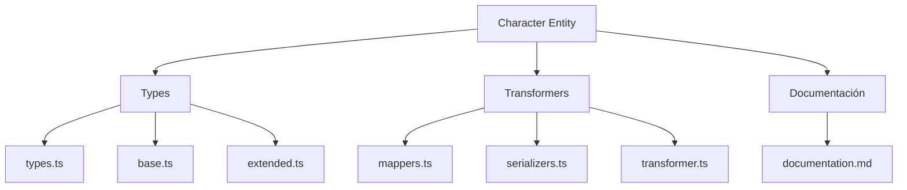
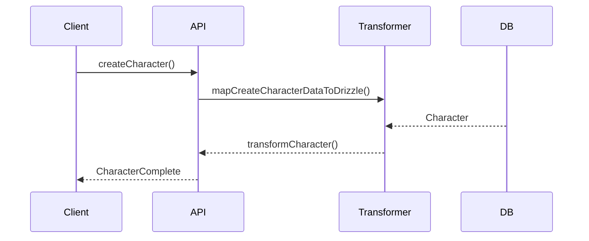

# 🧑‍🎤 Entidad Character

## Descripción

La entidad `Character` representa personajes que pueden asociarse a notas, imágenes, conceptos y otros elementos del sistema. Permite modelar protagonistas, antagonistas, NPCs y cualquier entidad narrativa.

## Estructura



## Tipos principales

- `CharacterBase`, `CharacterComplete`, `CharacterCreateInput`, `CharacterUpdateInput`
- Filtros: `CharacterFilters`, `CharacterSearchOptions`, `CharacterSearchResult`

## Ejemplo de uso

```typescript
import { createCharacter, updateCharacter, searchCharacters } from '@/transformers/character';

const nuevoPersonaje = await createCharacter({ name: 'Alicia', role: 'Protagonista' });
const personajes = await searchCharacters({ filters: { search: 'Alicia' } });
await updateCharacter(nuevoPersonaje.id, { role: 'Heroína' });
```

## Flujo de datos



## Mejores prácticas

- Usar siempre los tipos canónicos (`CharacterCreateInput`, `CharacterUpdateInput`, `CharacterComplete`).
- Validar los datos antes de crear/actualizar (`validateCharacter`).
- Usar los mapeadores para relaciones complejas.
- Mantener la documentación y diagramas actualizados.

## Integración

Los personajes pueden asociarse a:

- Notas, imágenes, álbumes, conceptos, prompts, grupos, etc.

Al eliminar un personaje, revisar las relaciones para evitar referencias huérfanas.

---

> Última actualización: 2025-06-10
