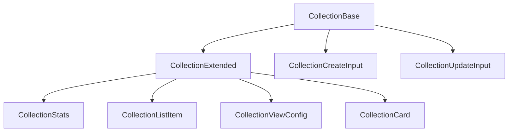

# 🌟 Collection: Tipos y Esquemas Canónicos

Este módulo define los **tipos canónicos** y **esquemas de validación Zod** para la entidad `Collection`, alineados con el modelo de dominio y las reglas del proyecto.

## 📦 Estructura



- `CollectionBase`: Tipo canónico alineado a la base de datos.
- `CollectionExtended`: Tipo enriquecido para UI y relaciones.
- `CollectionStats`: Estadísticas de la colección.
- `CollectionCreateInput`, `CollectionUpdateInput`: Inputs para mutaciones.
- `CollectionSchema`: Esquema Zod para validación.

## 🚨 Notas de migración

- **Legacy eliminado:** Solo se exportan tipos y enums canónicos.

- **Validar siempre con CollectionSchema antes de persistir.**

## 📝 Ejemplo de uso

```ts
import type { CollectionBase, CollectionCreateInput } from '@/types/entities/collection';
import { CollectionSchema } from '@/types/entities/collection/types';

const nueva: CollectionCreateInput = { name: 'NFTs', type: 'digital', isPublic: true, isFavorite: false };
const validada = CollectionSchema.parse(nueva);
```

---

> Última actualización: 2025-06-18
> Responsable: migración y limpieza de tipos canónicos
