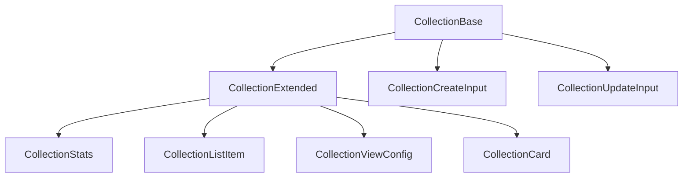

# Collection: canonical types and schemas

This module defines the **canonical types** and **Zod validation schemas** for the `Collection` entity. The types align with the domain model and project rules.

## Structure



The module uses these types:

- `CollectionBase`: Canonical type aligned with the database.
- `CollectionExtended`: Type enriched for UI and relations.
- `CollectionStats`: Collection statistics.
- `CollectionCreateInput`, `CollectionUpdateInput`: Inputs for mutations.
- `CollectionSchema`: Zod schema for validation.

## Migration notes

- **Legacy removed:** Only canonical types and enums are exported.
- **Validate with CollectionSchema before you persist.**

## Usage example

```ts
import type { CollectionBase, CollectionCreateInput } from '@/types/entities/collection';
import { CollectionSchema } from '@/types/entities/collection/types';

const created: CollectionCreateInput = { name: 'NFTs', type: 'digital', isFavorite: false };
const validated = CollectionSchema.parse(created);
```

---

> Last update: 2025-06-18
> Owner: migration and cleanup of canonical types
