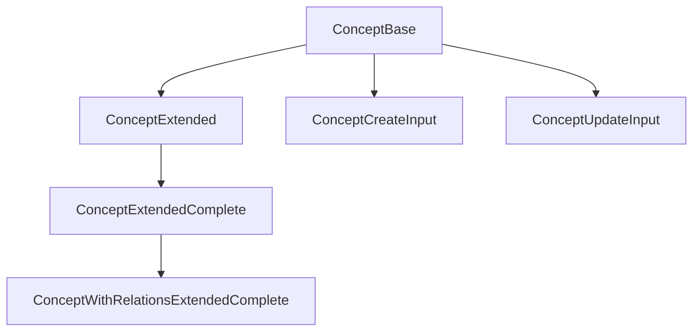

# Concept: canonical types and schemas

This module defines the **canonical types** and **Zod validation schemas** for the `Concept` entity. The types align with the domain model and project rules.

## Structure



The module uses these types:

- `ConceptBase`: Canonical type aligned with the database.
- `ConceptExtended`, `ConceptExtendedComplete`: Types enriched for UI and relations.
- `ConceptWithRelationsExtendedComplete`: Extended version with relations and stats.
- `ConceptCreateInput`, `ConceptUpdateInput`: Inputs for mutations.
- `ConceptSchema`: Zod schema for validation.

## Migration notes

- **Legacy removed:** Only canonical types and enums are exported.
- **Validate with ConceptSchema before you persist.**

## Usage example

```ts
import type { ConceptBase, ConceptCreateInput } from '@/types/entities/concept';
import { ConceptSchema } from '@/types/entities/concept/types';

const created: ConceptCreateInput = { name: 'Magic', content: 'Magic system', category: 'lore' };
const validated = ConceptSchema.parse(created);
```

---

> Last update: 2025-06-18
> Owner: migration and cleanup of canonical types
