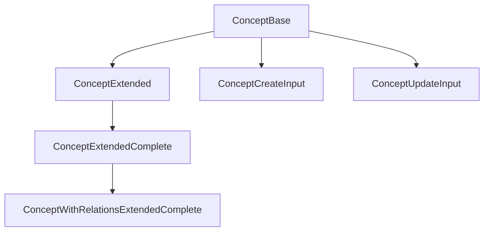

# 💡 Concept: Tipos y Esquemas Canónicos

Este módulo define los **tipos canónicos** y **esquemas de validación Zod** para la entidad `Concept`, alineados con el modelo de dominio y las reglas del proyecto.

## 📦 Estructura



- `ConceptBase`: Tipo canónico alineado a la base de datos.
- `ConceptExtended`, `ConceptExtendedComplete`: Tipos enriquecidos para UI y relaciones.
- `ConceptWithRelationsExtendedComplete`: Versión extendida con relaciones y stats.
- `ConceptCreateInput`, `ConceptUpdateInput`: Inputs para mutaciones.
- `ConceptSchema`: Esquema Zod para validación.

## 🚨 Notas de migración

- **Legacy eliminado:** Solo se exportan tipos y enums canónicos.
- **No importar tipos de Prisma ni archivos legacy.**
- **Validar siempre con ConceptSchema antes de persistir.**

## 📝 Ejemplo de uso

```ts
import type { ConceptBase, ConceptCreateInput } from '@/types/entities/concept';
import { ConceptSchema } from '@/types/entities/concept/types';

const nuevo: ConceptCreateInput = { name: 'Magia', content: 'Sistema de magia', category: 'lore' };
const validado = ConceptSchema.parse(nuevo);
```

---

> Última actualización: 2025-06-18
> Responsable: migración y limpieza de tipos canónicos
