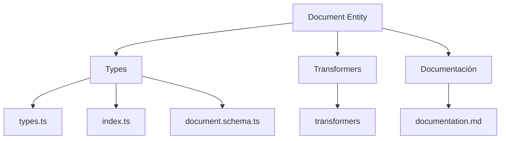
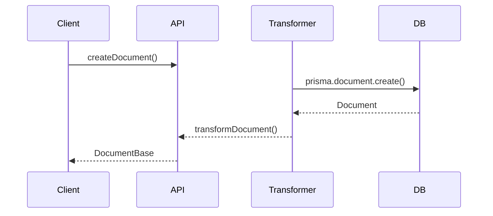

# 📄 Entidad Document

## Descripción

La entidad `Document` representa documentos de texto, markdown o archivos de notas que pueden ser creados, almacenados y gestionados en el sistema. Estos documentos pueden contener información diversa como documentación, guías, tutoriales, etc.

## Estructura



## Tipos principales

- `DocumentBase`: Tipo base con campos fundamentales
- `DocumentCreateInput`: Input para creación de documentos
- `DocumentUpdateInput`: Input para actualización de documentos

## Ejemplo de uso

```typescript
import { createDocument, updateDocument, getDocument } from '@/transformers/document';

// Crear un nuevo documento
const nuevoDocumento = await createDocument({
  name: 'Guía de uso',
  filePath: '/docs/guia-uso.md',
  content: '# Guía de uso\n\nEste documento explica cómo utilizar la aplicación.\n\n## Inicio rápido\n...'
});

// Obtener un documento existente
const documento = await getDocument(nuevoDocumento.id);

// Actualizar un documento existente
await updateDocument(nuevoDocumento.id, {
  content: '# Guía de uso actualizada\n\nEste documento explica cómo utilizar la aplicación de manera efectiva.\n\n## Inicio rápido\n...'
});
```

## Flujo de datos



## Mejores prácticas

- Usar siempre los tipos canónicos (`DocumentCreateInput`, `DocumentUpdateInput`, `DocumentBase`).
- Validar los datos antes de crear/actualizar con el esquema Zod `documentSchema`.
- El campo `content` puede contener texto plano, markdown u otro formato de texto estructurado.
- Establecer convenciones para las rutas de archivo en el campo `filePath` para una organización coherente.

## Integración

Los documentos pueden integrarse con:

- Tutoriales y ayuda en la aplicación
- Documentación técnica y de usuario
- Notas extensas o estructuradas
- Contenido estático para páginas informativas

## Migración a tipos canónicos

✅ Tipos canónicos implementados desde el inicio, documentación y diagrama actualizados.

---

> Última actualización: 2025-06-18