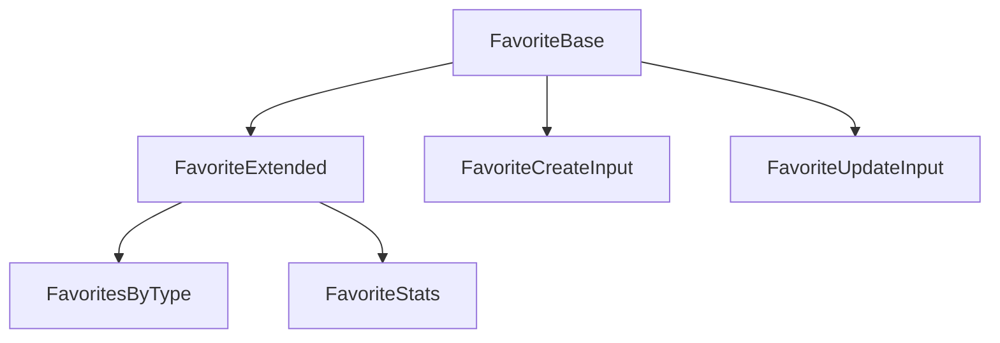

# ⭐ Favorite: Tipos y Esquemas Canónicos

Este módulo define los **tipos canónicos** y extendidos para la entidad `Favorite`, alineados con el modelo de dominio y las reglas del proyecto.

## 📦 Estructura



- `FavoriteBase`: Tipo canónico alineado a la base de datos.
- `FavoriteExtended`: Tipo enriquecido para UI y relaciones.
- `FavoritesByType`, `FavoriteStats`: Tipos extendidos para lógica y visualización.
- `FavoriteCreateInput`, `FavoriteUpdateInput`: Inputs para mutaciones.

## 🚨 Notas de migración

- **Legacy eliminado:** Solo se exportan tipos y enums canónicos.
- **No importar tipos de Prisma ni archivos legacy.**
- **Validar siempre con Zod antes de persistir.**

## 📝 Ejemplo de uso

```ts
import type { FavoriteBase, FavoriteCreateInput } from '@/types/entities/favorite';
// Validar con Zod según lógica de negocio
```

---

> Última actualización: 2025-06-18
> Responsable: migración y limpieza de tipos canónicos
