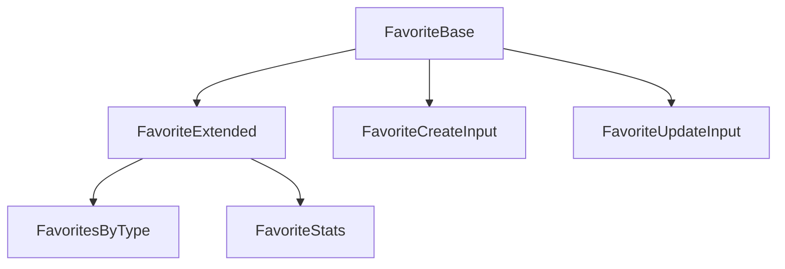

# Favorite: canonical types and schemas

This module defines the **canonical** and extended types for the `Favorite` entity. The types align with the domain model and project rules.

## Structure



The module uses these types:

- `FavoriteBase`: Canonical type aligned with the database.
- `FavoriteExtended`: Type enriched for UI and relations.
- `FavoritesByType`, `FavoriteStats`: Extended types for logic and display.
- `FavoriteCreateInput`, `FavoriteUpdateInput`: Inputs for mutations.

## Migration notes

- **Legacy removed:** Only canonical types and enums are exported.
- **Validate with Zod before you persist.**

## Usage example

```ts
import type { FavoriteBase, FavoriteCreateInput } from '@/types/entities/favorite';
// Validate with Zod according to business logic
```

---

> Last update: 2025-06-18
> Owner: migration and cleanup of canonical types
