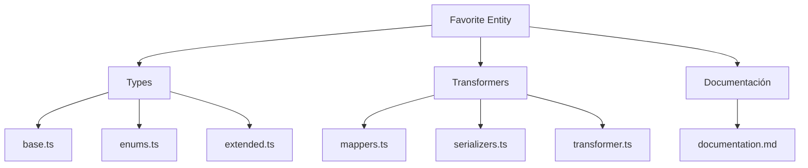
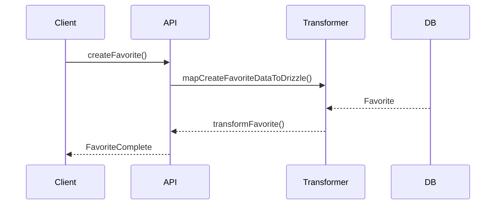

# ⭐ Entidad Favorite

## Descripción

La entidad `Favorite` representa la marcación de favoritos sobre cualquier recurso del sistema (imágenes, álbumes, colecciones, personajes, etc.), permitiendo a los usuarios destacar y acceder rápidamente a sus elementos preferidos.

---

## Estructura



---

## Tipos principales

- `FavoriteBase`, `FavoriteComplete`, `FavoriteCreateInput`, `FavoriteUpdateInput`
- Filtros: `FavoriteFilters`, `FavoriteSearchOptions`, `FavoriteSearchResult`

---

## Ejemplo de uso

```typescript
import { createFavorite, removeFavorite, searchFavorites } from '@/transformers/favorite';

const fav = await createFavorite({ entityId: 'img-123', entityType: 'image' });
const favoritos = await searchFavorites({ filters: { entityType: 'image' } });
await removeFavorite(fav.id);
```

---

## Flujo de datos



---

## Mejores prácticas

- Usar siempre los tipos canónicos (`FavoriteCreateInput`, `FavoriteUpdateInput`, `FavoriteComplete`).
- Validar los datos antes de crear/actualizar (`validateFavorite`).
- Usar los mapeadores para relaciones complejas.
- Mantener la documentación y diagramas actualizados.

---

## Integración

Los favoritos pueden asociarse a:

- Imágenes, álbumes, colecciones, personajes, lugares, notas, conceptos, prompts, grupos, etc.

Al eliminar un favorito, revisar las relaciones para evitar referencias huérfanas.

---

> Última actualización: 2025-06-10
