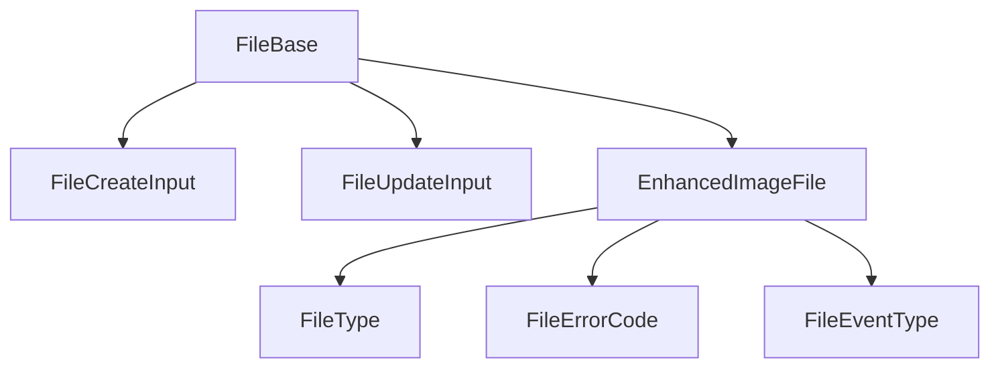

# File: canonical types and schemas

This module defines the **canonical** and extended types for the `File` entity. The types align with the domain model and project rules.

## Structure



The module uses these types:

- `FileBase`: Canonical type aligned with the database.
- `EnhancedImageFile`: Extended type for images with enriched metadata.
- `FileCreateInput`, `FileUpdateInput`: Inputs for mutations.
- `FileType`, `FileErrorCode`, `FileEventType`: Enums for logic and validation.

## Migration notes

- **Legacy removed:** Only canonical types and enums are exported.
- **Validate with Zod before you persist.**

## Usage example

```ts
import type { FileBase, FileCreateInput } from '@/types/entities/file';
// Validate with Zod according to business logic
```

---

> Last update: 2025-06-18
> Owner: migration and cleanup of canonical types
