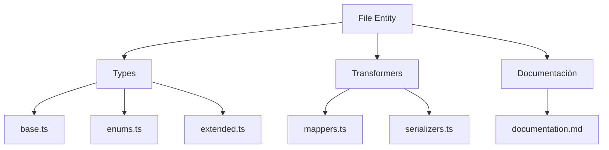
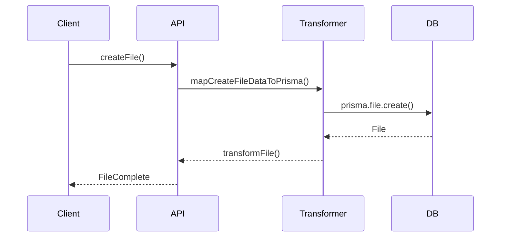

# 📁 Entidad File

## Descripción

La entidad `File` representa archivos genéricos almacenados en el sistema, incluyendo imágenes, videos, documentos, audios, etc. Permite gestionar metadatos, relaciones y operaciones sobre archivos de cualquier tipo.

---

## Estructura



---

## Tipos principales

- `FileBase`, `FileComplete`, `FileCreateInput`, `FileUpdateInput`
- Filtros: `FileFilters`, `FileSearchOptions`, `FileSearchResult`

---

## Ejemplo de uso

```typescript
import { createFile, updateFile, searchFiles } from '@/transformers/file/serializers';

const nuevoArchivo = await createFile({ name: 'documento.pdf', url: '/uploads/documento.pdf' });
const archivos = await searchFiles({ filters: { search: 'documento' } });
await updateFile(nuevoArchivo.id, { description: 'Documento actualizado.' });
```

---

## Flujo de datos



---

## Mejores prácticas

- Usar siempre los tipos canónicos (`FileCreateInput`, `FileUpdateInput`, `FileComplete`).
- Validar los datos antes de crear/actualizar (`validateFile`).
- Usar los mapeadores para relaciones complejas.
- Mantener la documentación y diagramas actualizados.

---

## Integración

Los archivos pueden asociarse a:

- Imágenes, álbumes, colecciones, usuarios, procesos automáticos, etc.

Al eliminar un archivo, revisar las relaciones para evitar referencias huérfanas.

---

> Última actualización: 2025-06-10
