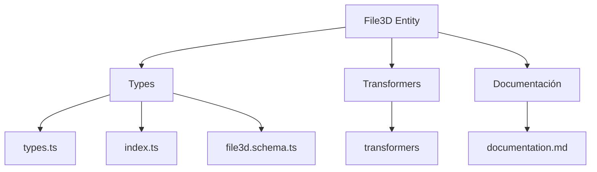
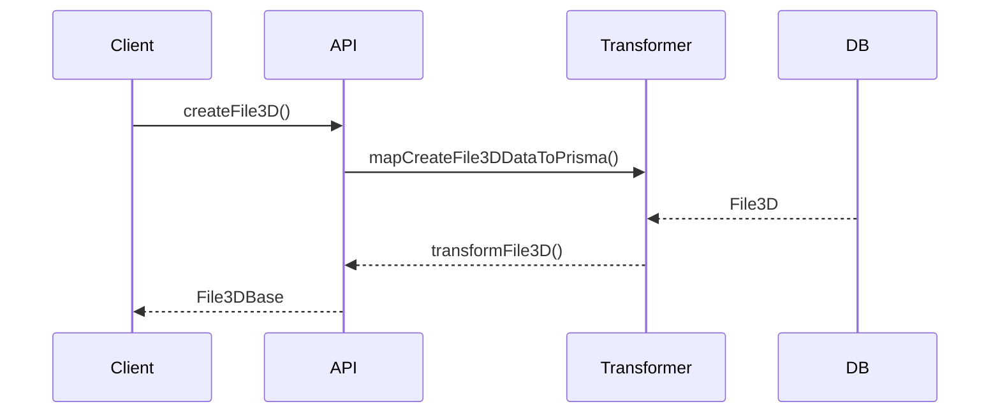

# 🗂️ Entidad File3D

## Descripción

La entidad `File3D` representa archivos tridimensionales como modelos 3D, escenas o recursos que pueden ser almacenados y gestionados en el sistema. Estos archivos pueden ser utilizados en visualizaciones 3D, prototipos digitales, entornos virtuales, etc.

## Estructura



## Tipos principales

- `File3DBase`: Tipo base con campos fundamentales
- `File3DCreateInput`: Input para creación de archivos 3D
- `File3DUpdateInput`: Input para actualización de archivos 3D

## Ejemplo de uso

```typescript
import { createFile3D, updateFile3D, getFile3D } from '@/transformers/file3d';

// Crear un nuevo archivo 3D
const nuevoArchivo = await createFile3D({
  name: 'Modelo de producto',
  filePath: '/models/producto.glb',
  format: 'glb',
  size: 2048576 // tamaño en bytes (2MB)
});

// Obtener un archivo 3D existente
const archivo = await getFile3D(nuevoArchivo.id);

// Actualizar un archivo 3D existente
await updateFile3D(nuevoArchivo.id, {
  name: 'Modelo de producto actualizado',
  size: 3145728 // tamaño actualizado (3MB)
});
```

## Flujo de datos



## Mejores prácticas

- Usar siempre los tipos canónicos (`File3DCreateInput`, `File3DUpdateInput`, `File3DBase`).
- Validar los datos antes de crear/actualizar con el esquema Zod `file3DSchema`.
- Soportar múltiples formatos comunes de archivos 3D como GLB, OBJ, FBX, GLTF, etc.
- Considerar metadatos adicionales como dimensiones, polígonos, texturas, etc.
- Implementar previsualización de modelos 3D en la interfaz de usuario.

## Integración

Los archivos 3D pueden integrarse con:

- Visualizadores 3D en la aplicación
- Herramientas de diseño y prototipado
- Catálogos de productos o recursos
- Entornos virtuales o de realidad aumentada

## Migración a tipos canónicos

✅ Tipos canónicos implementados desde el inicio, documentación y diagrama actualizados.

---

> Última actualización: 2025-06-18