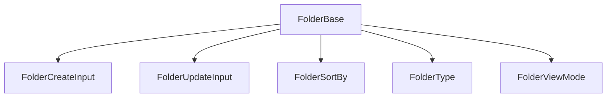

# 📂 Folder: Tipos y Esquemas Canónicos

Este módulo define los **tipos canónicos** y enums para la entidad `Folder`, alineados con el modelo de dominio y las reglas del proyecto.

## 📦 Estructura



- `FolderBase`: Tipo canónico alineado a la base de datos.
- `FolderCreateInput`, `FolderUpdateInput`: Inputs para mutaciones.
- `FolderSortBy`, `FolderType`, `FolderViewMode`: Enums para lógica y visualización.
- `FolderSchema`: Esquema Zod para validación.

## 🚨 Notas de migración

- **Legacy eliminado:** Solo se exportan tipos y enums canónicos.
- **No importar tipos de Prisma ni archivos legacy.**
- **Validar siempre con FolderSchema antes de persistir.**

## 📝 Ejemplo de uso

```ts
import type { FolderBase, FolderCreateInput } from '@/types/entities/folder';
import { FolderSchema } from '@/types/entities/folder/types';

const nueva: FolderCreateInput = { name: 'Proyectos', path: '/proyectos' };
const validada = FolderSchema.parse(nueva);
```

---

> Última actualización: 2025-06-18
> Responsable: migración y limpieza de tipos canónicos
