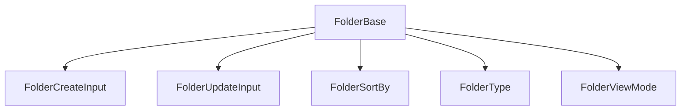

# Folder: canonical types and schemas

This module defines the **canonical types** and enums for the `Folder` entity. The types align with the domain model and project rules.

## Structure



The module uses these types:

- `FolderBase`: Canonical type aligned with the database.
- `FolderCreateInput`, `FolderUpdateInput`: Inputs for mutations.
- `FolderSortBy`, `FolderType`, `FolderViewMode`: Enums for logic and display.
- `FolderSchema`: Zod schema for validation.

## Migration notes

- **Legacy removed:** Only canonical types and enums are exported.
- **Validate with FolderSchema before you persist.**

## Usage example

```ts
import type { FolderBase, FolderCreateInput } from '@/types/entities/folder';
import type { FolderSchema } from '@/types/entities/folder/types';

const created: FolderCreateInput = { name: 'Projects', path: '/projects' };
const validated = FolderSchema.parse(created);
```

---

> Last update: 2025-06-18
> Owner: migration and cleanup of canonical types
