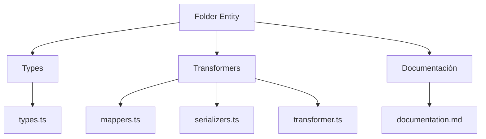
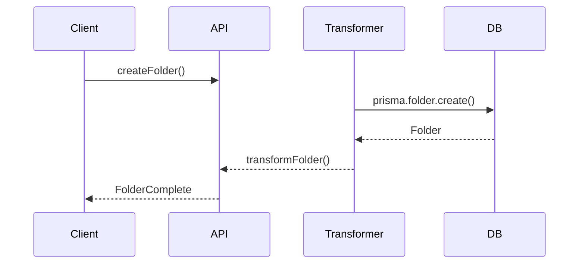

# 📁 Entidad Folder

## Descripción

La entidad `Folder` representa carpetas o directorios virtuales para organizar imágenes, videos, notas y otros recursos. Permite jerarquía, agrupación y navegación estructurada.

## Estructura



## Tipos principales

- `FolderBase`, `FolderComplete`, `FolderExtended`, `FolderExtendedComplete`
- Filtros: `FolderFilters`, `FolderSearchOptions`, `FolderSearchResult`

## Ejemplo de uso

```typescript
import { createFolder, updateFolder, searchFolders } from '@/transformers/folder';

const nuevaCarpeta = await createFolder({ name: 'Proyectos', parentId: null });
const carpetas = await searchFolders({ filters: { search: 'Proyectos' } });
await updateFolder(nuevaCarpeta.id, { name: 'Proyectos 2025' });
```

## Flujo de datos



## Mejores prácticas

- Usar siempre los tipos canónicos (`FolderBase`, `FolderComplete`).
- Validar los datos antes de crear/actualizar (`validateFolder`).
- Usar los mapeadores para relaciones complejas.
- Mantener la documentación y diagramas actualizados.

## Integración

Las carpetas pueden contener:

- Imágenes, videos, subcarpetas, notas, etc.

Al eliminar una carpeta, revisar las relaciones para evitar referencias huérfanas.

---

> Última actualización: 2025-06-10
