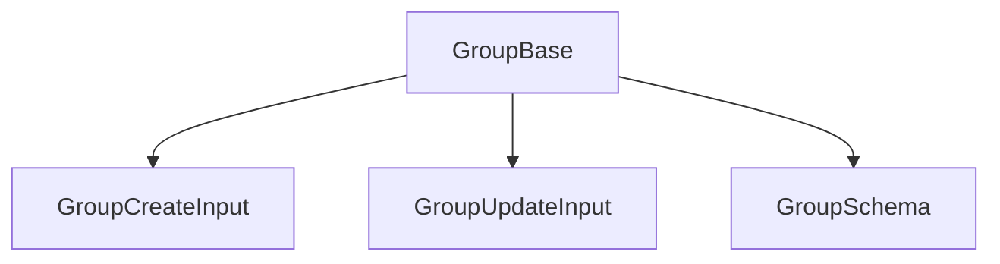

# 🗂️ Group: Tipos y Esquemas Canónicos

Este módulo define los **tipos canónicos** y el esquema Zod para la entidad `Group`, alineados con el modelo de dominio y las reglas del proyecto.

## 📦 Estructura



- `GroupBase`: Tipo canónico alineado a la base de datos.
- `GroupCreateInput`, `GroupUpdateInput`: Inputs para mutaciones.
- `GroupSchema`: Esquema Zod para validación.

## 🚨 Notas de migración

- **Legacy eliminado:** Solo se exportan tipos canónicos.
  \*\*
- **Validar siempre con GroupSchema antes de persistir.**

## 📝 Ejemplo de uso

```ts
import type { GroupBase, GroupCreateInput } from '@/types/entities/group';
import { GroupSchema } from '@/types/entities/group/types';

const nuevo: GroupCreateInput = { name: 'Favoritos', emoji: '⭐', color: '#FFD700' };
const validado = GroupSchema.parse(nuevo);
```

---

> Última actualización: 2025-06-18
> Responsable: migración y limpieza de tipos canónicos
