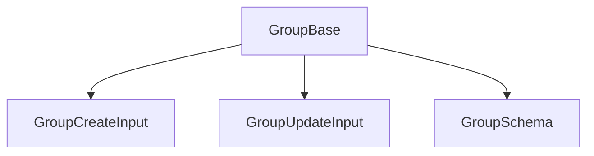

# Group: canonical types and schemas

This module defines the **canonical types** and the Zod schema for the `Group` entity. The types align with the domain model and project rules.

## Structure



The module uses these types:

- `GroupBase`: Canonical type aligned with the database.
- `GroupCreateInput`, `GroupUpdateInput`: Inputs for mutations.
- `GroupSchema`: Zod schema for validation.

## Migration notes

- **Legacy removed:** Only canonical types are exported.
- **Validate with GroupSchema before you persist.**

## Usage example

```ts
import type { GroupBase, GroupCreateInput } from '@/types/entities/group';
import { GroupSchema } from '@/types/entities/group/types';

const created: GroupCreateInput = { name: 'Favorites', emoji: '⭐', color: '#FFD700' };
const validated = GroupSchema.parse(created);
```

---

> Last update: 2025-06-18
> Owner: migration and cleanup of canonical types
