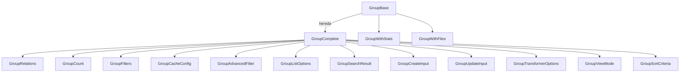

# Documentación de la Entidad Group

## Descripción

La entidad **Group** representa una agrupación lógica de recursos (imágenes, videos, álbumes, colecciones, etc.) dentro del sistema. Permite organizar y categorizar elementos, facilitando la gestión y visualización de grandes volúmenes de datos.

---

## Diagrama de Flujo (Mermaid)



---

## Estructura y Relaciones

- **types.ts**: Define los tipos canónicos (`GroupBase`, `GroupComplete`, `GroupCreateInput`, `GroupUpdateInput`, etc.) y enums.
- **schema.ts**: Esquemas Zod para validación de datos y filtros.
- **mappers.ts**: Funciones para mapear datos de Group a formatos de UI y búsqueda.
- **serializers.ts**: Serialización/deserialización y validación robusta de datos.
- **transformer.ts**: Transformador principal, entrada unificada para conversión y extensión de Group.
- **index.ts**: Barrel limpio, solo exporta tipos y esquemas canónicos.

---

## Ejemplo de Uso

```typescript
import { transformGroup, transformGroupToWithStats } from '@/transformers/group/transformer';
import type { Group } from '@/types/entities/group';

const rawGroup: Group = { /* ... */ };
const groupComplete = transformGroup(rawGroup);
const groupWithStats = transformGroupToWithStats(groupComplete);
```

---

## Buenas Prácticas

- Usar **solo** los tipos canónicos (`GroupBase`, `GroupComplete`, `GroupCreateInput`, `GroupUpdateInput`).
- No extender ni modificar los tipos base fuera de este módulo.
- Utilizar los mappers y serializers para toda conversión de datos.
- Validar siempre los datos de entrada/salida con los esquemas Zod.
- Mantener el barrel (`index.ts`) limpio y sin duplicados.

---

## Notas

- Todos los campos de relaciones y conteos deben ser gestionados a través de los tipos y funciones canónicas.
- Los tipos legacy o duplicados han sido eliminados.
- El sistema de transformación y serialización incluye manejo robusto de errores y validación estricta.

---

## Última revisión

- Fecha: 2024-06-10
- Estado: ✅ Auditado, sin errores TS, documentación y diagramas actualizados.
