```mermaid
graph TD
    ImageBase --> ImageCreateInput
    ImageBase --> ImageUpdateInput
    ImageBase --> ImageComplete
    ImageBase --> ImageExtended
    ImageBase --> ImageFilters
    ImageBase --> ImageSearchOptions
    ImageBase --> ImageSearchResult
    ImageBase --> ImageTransformerOptions
    ImageBase --> ImageMetadata
    ImageBase --> ImageStatsBase
    ImageBase --> ImageVisualConfigBase
    ImageBase --> ImageAIMetadata
    ImageBase --> CreateImageData
    ImageBase --> UpdateImageData
    ImageBase --> ImageSchema
```

# 🖼️ Image: Tipos y Esquemas Canónicos

Este módulo define los **tipos canónicos** y el esquema Zod para la entidad `Image`, alineados con el modelo de dominio y las reglas del proyecto.

## 📦 Estructura



- `ImageBase`: Tipo canónico alineado a la base de datos.
- `ImageComplete`, `ImageExtended`: Tipos enriquecidos para relaciones y UI.
- `ImageCreateInput`, `ImageUpdateInput`: Inputs para mutaciones.
- `ImageSchema`: Esquema Zod para validación.

## 🚨 Notas de migración

- **Legacy eliminado:** Solo se exportan tipos canónicos.
- **No importar tipos de Prisma ni archivos legacy.**
- **Validar siempre con ImageSchema antes de persistir.**

## 📝 Ejemplo de uso

```ts
import type { ImageBase, ImageCreateInput } from '@/types/entities/image';
import { ImageSchema } from '@/types/entities/image/types';

const nueva: ImageCreateInput = { name: 'Foto', path: '/fotos/1.jpg', hash: 'abc', size: 123, width: 800, height: 600, folder: { id: 'f1' }, sortBy: 'name', filters: '' };
const validada = ImageSchema.parse(nueva);
```

---

> Última actualización: 2025-06-18
> Responsable: migración y limpieza de tipos canónicos
